# OLAF Self-Contained Installer Guide

## Overview
Create a self-embedded Go installer called `olaf` that embeds all OLAF framework files and manages installation/updates automatically.

## What Gets Embedded
- All files starting with `olaf-` in `.github`, `.kiro`, and `.windsurf`
- Complete `.olaf` directory structure
- Framework files and competencies

### Installer Behavior

### Default Operation (no arguments)
1. Check if `~/.olaf` exists with required structure:
   - `/core/skills`
   - `/competencies` 
   - `/reference`
   - `/reference/.condensed`
   - Condensed framework files
2. If exists: Update with new/modified files only
3. If not exists: Create full structure and copy all files
4. Copy `olaf-*` files from global `~/.olaf` to **local repo** in respective folders:
   - `.github/olaf-*` → local repo `.github/`
   - `.kiro/olaf-*` → local repo `.kiro/`
   - `.windsurf/olaf-*` → local repo `.windsurf/`
5. Check for collection selection:
   - If collection file exists in `~/.olaf/core/reference`: Do nothing
   - If no collection: Run `select-collection` functionality

### With --collection Argument
Trigger the same behavior as `select-collection` command

### **Important: Directory Structure Logic**

#### **Source Repository Structure** (where installer is built)
```bash
repo-root/
├── .github/          ← Contains olaf-* files
├── .kiro/            ← Contains olaf-* files  
├── .windsurf/        ← Contains olaf-* files
└── .olaf/            ← Complete framework
```

#### **Target Installation** (user's system)
```bash
~/.olaf/              ← Framework files ONLY
├── core/
├── data/
├── docs/
└── tools/

local-repo/           ← User's working repository
├── .github/          ← Gets olaf-* files
├── .kiro/            ← Gets olaf-* files
├── .windsurf/        ← Gets olaf-* files
└── .olaf/            ← User's local .olaf (if any)
```

#### **What Goes Where:**

**TO ~/.olaf/ (Framework Installation):**
- Complete `.olaf/` directory structure
- Core framework files
- Competencies and skills
- Reference materials
- Tools and documentation

**NEVER TO ~/.olaf/:**
- `.github/` directory
- `.kiro/` directory  
- `.windsurf/` directory
- Repository-specific files

**TO LOCAL REPO (Repository Setup):**
- `olaf-*` files from `.github/` → local repo `.github/`
- `olaf-*` files from `.kiro/` → local repo `.kiro/`
- `olaf-*` files from `.windsurf/` → local repo `.windsurf/`

## Project Structure

```
olaf/
├── main.go              # Main installer code
├── go.mod              # Go module file
├── assets/             # Embedded OLAF files
│   ├── github/         # .github content with olaf- files
│   ├── kiro/           # .kiro content with olaf- files  
│   ├── windsurf/       # .windsurf content with olaf- files
│   └── olaf/           # Complete .olaf directory
│       ├── core/
│       │   ├── competencies/
│       │   ├── reference/
│       │   │   └── .condensed/
│       │   └── schemas/
│       ├── data/
│       │   ├── context/
│       │   ├── kb/
│       │   └── peoples/
│       ├── docs/
│       └── tools/
└── build/              # Build scripts

## Complete OLAF Installer Code

```go
package main

import (
	"embed"
	"fmt"
	"io/fs"
	"os"
	"path/filepath"
	"runtime"
	"strings"
	"time"
)

//go:embed assets/*
var embeddedFiles embed.FS

//go:embed VERSION
var versionFile string

const (
	OLAF_GLOBAL_DIR = ".olaf"
	OLAF_LOCAL_DIR  = ".olaf"
)

func main() {
	if len(os.Args) == 1 {
		// Default operation - install/update
		installOrUpdateOLAF()
		return
	}

	switch os.Args[1] {
	case "--collection":
		selectCollection()
	case "version":
		showVersion()
	case "help":
		showHelp()
	default:
		fmt.Printf("Unknown command: %s\n", os.Args[1])
		showHelp()
	}
}

func installOrUpdateOLAF() {
	fmt.Println("🔄 OLAF Installer v1.0.0")
	fmt.Println("================================")

	homeDir := getHomeDir()
	globalOlafDir := filepath.Join(homeDir, OLAF_GLOBAL_DIR)
	
	// Check if OLAF is already installed
	if isOlafInstalled(globalOlafDir) {
		fmt.Println("📁 OLAF installation detected, updating...")
		updateOlafInstallation(globalOlafDir)
	} else {
		fmt.Println("📁 Installing OLAF framework...")
		installOlafFramework(globalOlafDir)
	}

	// Copy olaf-* files to local repository
	copyOlafFilesToLocalRepo(globalOlafDir)

	// Check collection selection
	if !hasCollectionSelection(globalOlafDir) {
		fmt.Println("\n🎯 No collection selected, running selection...")
		selectCollection()
	} else {
		fmt.Println("\n✅ Collection already selected")
	}

	fmt.Println("\n🎉 OLAF installation complete!")
}

func isOlafInstalled(olafDir string) bool {
	requiredPaths := []string{
		"core/skills",
		"competencies", 
		"reference",
		"reference/.condensed",
	}

	for _, path := range requiredPaths {
		fullPath := filepath.Join(olafDir, path)
		if _, err := os.Stat(fullPath); os.IsNotExist(err) {
			return false
		}
	}

	// Check for condensed framework files
	condensedDir := filepath.Join(olafDir, "reference", ".condensed")
	files, err := os.ReadDir(condensedDir)
	if err != nil || len(files) == 0 {
		return false
	}

	return true
}

func installOlafFramework(olafDir string) error {
	// Create base directory
	if err := os.MkdirAll(olafDir, 0755); err != nil {
		return fmt.Errorf("failed to create OLAF directory: %v", err)
	}

	// Extract embedded .olaf directory
	return extractEmbeddedFiles("assets/olaf", olafDir)
}

func updateOlafInstallation(olafDir string) error {
	// Walk through embedded files and update only new/modified
	return fs.WalkDir(embeddedFiles, "assets/olaf", func(path string, d fs.DirEntry, err error) error {
		if err != nil {
			return err
		}

		if d.IsDir() {
			return nil
		}

		// Get relative path from embedded files
		relPath := strings.TrimPrefix(path, "assets/olaf/")
		destPath := filepath.Join(olafDir, relPath)

		// Check if file needs updating
		if needsUpdate(path, destPath) {
			// Read embedded file
			data, err := embeddedFiles.ReadFile(path)
			if err != nil {
				return err
			}

			// Create directory if needed
			if err := os.MkdirAll(filepath.Dir(destPath), 0755); err != nil {
				return err
			}

			// Write file
			if err := os.WriteFile(destPath, data, 0644); err != nil {
				return err
			}

			fmt.Printf("📝 Updated: %s\n", relPath)
		}

		return nil
	})
}

func needsUpdate(embeddedPath, destPath string) bool {
	// If destination doesn't exist, needs update
	if _, err := os.Stat(destPath); os.IsNotExist(err) {
		return true
	}

	// Compare modification times (simplified - in production you'd use checksums)
	embeddedInfo, err := fs.Stat(embeddedFiles, embeddedPath)
	if err != nil {
		return true
	}

	destInfo, err := os.Stat(destPath)
	if err != nil {
		return true
	}

	// If embedded file is newer, update
	return embeddedInfo.ModTime().After(destInfo.ModTime())
}

func copyOlafFilesToLocalRepo(globalOlafDir string) {
	// Get current working directory (should be repo root)
	wd, err := os.Getwd()
	if err != nil {
		fmt.Printf("❌ Could not determine working directory: %v\n", err)
		return
	}

	// IMPORTANT: Only copy olaf-* files to local repo
	// These come from embedded assets, NOT from ~/.olaf
	
	// Copy olaf-* files from embedded .github to local repo .github
	copyOlafFilesFromEmbedded("assets/github", filepath.Join(wd, ".github"))
	
	// Copy olaf-* files from embedded .kiro to local repo .kiro
	copyOlafFilesFromEmbedded("assets/kiro", filepath.Join(wd, ".kiro"))
	
	// Copy olaf-* files from embedded .windsurf to local repo .windsurf
	copyOlafFilesFromEmbedded("assets/windsurf", filepath.Join(wd, ".windsurf"))
}

func copyOlafFilesFromEmbedded(srcPrefix, destDir string) {
	// Walk through embedded files in source directory
	fs.WalkDir(embeddedFiles, srcPrefix, func(path string, d fs.DirEntry, err error) error {
		if err != nil {
			return err
		}

		// Only process files, not directories
		if d.IsDir() {
			return nil
		}

		// Only copy files starting with "olaf-"
		filename := filepath.Base(path)
		if !strings.HasPrefix(filename, "olaf-") {
			return nil
		}

		// Read embedded file
		data, err := embeddedFiles.ReadFile(path)
		if err != nil {
			return err
		}

		// Get relative path from source prefix
		relPath := strings.TrimPrefix(path, srcPrefix+"/")
		destPath := filepath.Join(destDir, relPath)

		// Create directory if needed
		if err := os.MkdirAll(filepath.Dir(destPath), 0755); err != nil {
			return err
		}

		// Write file to local repo
		if err := os.WriteFile(destPath, data, 0644); err != nil {
			return err
		}

		fmt.Printf("📋 Copied to repo: %s\n", relPath)
		return nil
	})
}

func hasCollectionSelection(olafDir string) bool {
	collectionFile := filepath.Join(olafDir, "core", "reference", "collection")
	if _, err := os.Stat(collectionFile); os.IsNotExist(err) {
		return false
	}
	return true
}

func selectCollection() {
	fmt.Println("\n🎯 Collection Selection")
	fmt.Println("======================")
	fmt.Println("Available collections:")
	fmt.Println("1. default - Standard OLAF competencies")
	fmt.Println("2. advanced - Extended competencies")
	fmt.Println("3. minimal - Core competencies only")
	
	var choice string
	fmt.Print("\nSelect collection (1-3): ")
	fmt.Scan(&choice)

	homeDir := getHomeDir()
	olafDir := filepath.Join(homeDir, OLAF_GLOBAL_DIR)
	collectionFile := filepath.Join(olafDir, "core", "reference", "collection")

	var selectedCollection string
	switch choice {
	case "1":
		selectedCollection = "default"
	case "2":
		selectedCollection = "advanced"
	case "3":
		selectedCollection = "minimal"
	default:
		fmt.Println("Invalid choice, using default")
		selectedCollection = "default"
	}

	// Write collection selection
	if err := os.WriteFile(collectionFile, []byte(selectedCollection), 0644); err != nil {
		fmt.Printf("❌ Failed to save collection selection: %v\n", err)
		return
	}

	fmt.Printf("✅ Collection '%s' selected\n", selectedCollection)
}

func extractEmbeddedFiles(srcPrefix, destDir string) error {
	return fs.WalkDir(embeddedFiles, srcPrefix, func(path string, d fs.DirEntry, err error) error {
		if err != nil {
			return err
		}

		if d.IsDir() {
			return nil
		}

		// Read embedded file
		data, err := embeddedFiles.ReadFile(path)
		if err != nil {
			return err
		}

		// Remove prefix for destination path
		relPath := strings.TrimPrefix(path, srcPrefix)
		destPath := filepath.Join(destDir, relPath)

		// Create directory if needed
		if err := os.MkdirAll(filepath.Dir(destPath), 0755); err != nil {
			return err
		}

		// Write file
		if err := os.WriteFile(destPath, data, 0644); err != nil {
			return err
		}

		fmt.Printf("📄 Installed: %s\n", relPath)
		return nil
	})
}

func getHomeDir() string {
	if runtime.GOOS == "windows" {
		return os.Getenv("USERPROFILE")
	}
	return os.Getenv("HOME")
}

func showVersion() {
	data, _ := embeddedFiles.ReadFile("VERSION")
	fmt.Printf("OLAF Installer v%s (%s)\n", strings.TrimSpace(string(data)), getPlatformInfo())
}

func showHelp() {
	fmt.Println("OLAF Installer - Self-contained OLAF framework installer")
	fmt.Printf("Platform: %s\n", getPlatformInfo())
	fmt.Println("")
	fmt.Println("Usage:")
	fmt.Println("  olaf              Install or update OLAF")
	fmt.Println("  olaf --collection Select collection")
	fmt.Println("  olaf version      Show version")
	fmt.Println("  olaf help         Show this help")
	fmt.Println("")
	fmt.Println("What it does:")
	fmt.Println("- Installs OLAF framework to ~/.olaf")
	fmt.Println("- Updates existing installations")
	fmt.Println("- Copies olaf-* files to local repository")
	fmt.Println("- Manages collection selection")
	fmt.Println("")
	fmt.Println("Supported platforms:")
	fmt.Println("- Windows (Intel/AMD 32/64-bit, ARM64)")
	fmt.Println("- macOS (Intel, Apple Silicon, Universal)")
	fmt.Println("- Linux (Intel/AMD 32/64-bit, ARM 32/64-bit)")
}
```

## Build Instructions

### 1. Create Project Structure
```bash
mkdir olaf
cd olaf
```

### 2. Create Go Module
```bash
go mod init olaf
```

### 3. Prepare Assets
```bash
# Create assets directory structure
mkdir -p assets/github
mkdir -p assets/kiro  
mkdir -p assets/windsurf
mkdir -p assets/olaf

# Copy OLAF files to assets
# Copy all olaf-* files from .github, .kiro, .windsurf
cp -r .github/olaf-* assets/github/ 2>/dev/null || true
cp -r .kiro/olaf-* assets/kiro/ 2>/dev/null || true  
cp -r .windsurf/olaf-* assets/windsurf/ 2>/dev/null || true

# Copy complete .olaf directory
cp -r .olaf/* assets/olaf/

# Create VERSION file
echo "1.0.0" > VERSION
```

### 4. Build for All Platforms (ARM/AMD, 32/64-bit)

#### Windows Builds
```bash
# Windows 64-bit (most common)
GOOS=windows GOARCH=amd64 go build -ldflags "-s -w" -o olaf-windows-amd64.exe

# Windows 32-bit (legacy systems)
GOOS=windows GOARCH=386 go build -ldflags "-s -w" -o olaf-windows-386.exe

# Windows ARM64 (newer Windows on ARM devices)
GOOS=windows GOARCH=arm64 go build -ldflags "-s -w" -o olafrm64.exe
```

#### macOS Builds
```bash
# macOS Intel 64-bit (most common)
GOOS=darwin GOARCH=amd64 go build -ldflags "-s -w" -o olaf

# macOS Apple Silicon (M1/M2/M3)
GOOS=darwin GOARCH=arm64 go build -ldflags "-s -w" -o olaf64

# macOS Universal Binary (combines both Intel and Apple Silicon)
# Build separately first, then combine:
GOOS=darwin GOARCH=amd64 go build -ldflags "-s -w" -o olaf-macos-amd64
GOOS=darwin GOARCH=arm64 go build -ldflags "-s -w" -o olaf-macos-arm64
# Combine into universal binary
lipo -create olaf-macos-amd64 olaf-macos-arm64 -output olaf-macos-universal
```

#### Linux Builds
```bash
# Linux 64-bit (most common)
GOOS=linux GOARCH=amd64 go build -ldflags "-s -w" -o olaf-linux-amd64

# Linux 32-bit (legacy systems)
GOOS=linux GOARCH=386 go build -ldflags "-s -w" -o olaf-linux-386

# Linux ARM64 (aarch64 servers, Raspberry Pi 4+)
GOOS=linux GOARCH=arm64 go build -ldflags "-s -w" -o olaf-linux-arm64

# Linux ARM v7 (32-bit, Raspberry Pi 3/4)
GOOS=linux GOARCH=arm GOARM=7 go build -ldflags "-s -w" -o olaf-linux-armv7

# Linux ARM v6 (Raspberry Pi Zero/1)
GOOS=linux GOARCH=arm GOARM=6 go build -ldflags "-s -w" -o olaf-linux-armv6
```

#### Complete Build Script
```bash
#!/bin/bash
# build-all.sh - Build for all platforms

echo "🔨 Building OLAF Installer for all platforms..."

# Windows
echo "Building Windows versions..."
GOOS=windows GOARCH=amd64 go build -ldflags "-s -w" -o olaf-windows-amd64.exe
GOOS=windows GOARCH=386 go build -ldflags "-s -w" -o olaf-windows-386.exe
GOOS=windows GOARCH=arm64 go build -ldflags "-s -w" -o olaf-windows-arm64.exe

# macOS
echo "Building macOS versions..."
GOOS=darwin GOARCH=amd64 go build -ldflags "-s -w" -o olaf-macos-amd64
GOOS=darwin GOARCH=arm64 go build -ldflags "-s -w" -o olaf-macos-arm64
lipo -create olaf-macos-amd64 olaf-macos-arm64 -output olaf-macos-universal

# Linux
echo "Building Linux versions..."
GOOS=linux GOARCH=amd64 go build -ldflags "-s -w" -o olaf-linux-amd64
GOOS=linux GOARCH=386 go build -ldflags "-s -w" -o olaf-linux-386
GOOS=linux GOARCH=arm64 go build -ldflags "-s -w" -o olaf-linux-arm64
GOOS=linux GOARCH=arm GOARM=7 go build -ldflags "-s -w" -o olaf-linux-armv7
GOOS=linux GOARCH=arm GOARM=6 go build -ldflags "-s -w" -o olaf-linux-armv6

echo "✅ Build complete!"
ls -lh olaf-*
```

#### Platform Detection in Code
```go
// Add to main.go for better platform handling
import (
    "runtime"
    "strings"
)

func getPlatformInfo() string {
    return fmt.Sprintf("%s/%s (%s)", runtime.GOOS, runtime.GOARCH, getProcessorType())
}

func getProcessorType() string {
    switch runtime.GOARCH {
    case "amd64":
        if runtime.GOOS == "windows" {
            return "Intel/AMD 64-bit"
        }
        return "Intel 64-bit"
    case "386":
        return "Intel/AMD 32-bit"
    case "arm64":
        if runtime.GOOS == "darwin" {
            return "Apple Silicon"
        }
        return "ARM 64-bit"
    case "arm":
        return "ARM 32-bit"
    default:
        return runtime.GOARCH
    }
}

func getInstallerName() string {
    os := runtime.GOOS
    arch := runtime.GOARCH
    
    switch {
    case os == "windows" && arch == "amd64":
        return "olaf-windows-amd64.exe"
    case os == "windows" && arch == "386":
        return "olaf-windows-386.exe"
    case os == "windows" && arch == "arm64":
        return "olaf-windows-arm64.exe"
    case os == "darwin" && arch == "amd64":
        return "olaf-macos-amd64"
    case os == "darwin" && arch == "arm64":
        return "olaf-macos-arm64"
    case os == "linux" && arch == "amd64":
        return "olaf-linux-amd64"
    case os == "linux" && arch == "386":
        return "olaf-linux-386"
    case os == "linux" && arch == "arm64":
        return "olaf-linux-arm64"
    case os == "linux" && arch == "arm":
        return "olaf-linux-armv7"
    default:
        return "olaf-" + os + "-" + arch
    }
}
```

### 5. Check Binary Size
```bash
ls -lh olaf*
```

## Update Mechanism Explained

### How Updates Work After Initial Installation

Once a user has installed OLAF, the update process is intelligent and efficient. Here's how it works:

#### 1. Installation Detection
When the installer runs (without arguments), it first checks if OLAF is already installed:

```go
func isOlafInstalled(olafDir string) bool {
    // Checks for these required paths:
    requiredPaths := []string{
        "core/skills",
        "competencies", 
        "reference",
        "reference/.condensed",
    }
    
    // Verifies each path exists
    for _, path := range requiredPaths {
        fullPath := filepath.Join(olafDir, path)
        if _, err := os.Stat(fullPath); os.IsNotExist(err) {
            return false  // Not installed
        }
    }
    
    // Checks for condensed framework files
    condensedDir := filepath.Join(olafDir, "reference", ".condensed")
    files, err := os.ReadDir(condensedDir)
    return err == nil && len(files) > 0
}
```

#### 2. Smart Update Process
If OLAF is detected as installed, the installer switches to **update mode**:

```go
func updateOlafInstallation(olafDir string) error {
    // Walk through embedded files and update only new/modified
    return fs.WalkDir(embeddedFiles, "assets/olaf", func(path string, d fs.DirEntry, err error) error {
        if err != nil || d.IsDir() {
            return err
        }

        // Get relative path from embedded files
        relPath := strings.TrimPrefix(path, "assets/olaf/")
        destPath := filepath.Join(olafDir, relPath)

        // Check if file needs updating
        if needsUpdate(path, destPath) {
            // Read embedded file
            data, err := embeddedFiles.ReadFile(path)
            if err != nil {
                return err
            }

            // Create directory if needed
            if err := os.MkdirAll(filepath.Dir(destPath), 0755); err != nil {
                return err
            }

            // Write file
            if err := os.WriteFile(destPath, data, 0644); err != nil {
                return err
            }

            fmt.Printf("📝 Updated: %s\n", relPath)
        }

        return nil
    })
}
```

#### 3. Update Detection Logic
The installer uses multiple strategies to determine if a file needs updating:

```go
func needsUpdate(embeddedPath, destPath string) bool {
    // Strategy 1: File doesn't exist
    if _, err := os.Stat(destPath); os.IsNotExist(err) {
        return true  // New file, needs to be added
    }

    // Strategy 2: Modification time comparison
    embeddedInfo, err := fs.Stat(embeddedFiles, embeddedPath)
    if err != nil {
        return true  // Can't read embedded info, update to be safe
    }

    destInfo, err := os.Stat(destPath)
    if err != nil {
        return true  // Can't read dest info, update to be safe
    }

    // If embedded file is newer, update
    return embeddedInfo.ModTime().After(destInfo.ModTime())
}
```

## Automatic Version Checking from GitHub

### Built-in Update Detection

Since the installer is self-contained, it needs to check for newer versions online. Here's how to add automatic version checking from a GitHub repository:

#### 1. Version Check Implementation
```go
package main

import (
    "encoding/json"
    "io"
    "net/http"
    "time"
)

// GitHub API response structure
type GitHubRelease struct {
    TagName string `json:"tag_name"`
    Name    string `json:"name"`
    Body    string `json:"body"`
    PublishedAt string `json:"published_at"`
    HtmlUrl string `json:"html_url"`
}

const (
    GITHUB_REPO = "haal-ai-org/olaf"
    VERSION_CHECK_URL = "https://api.github.com/repos/" + GITHUB_REPO + "/releases/latest"
)

func checkForUpdates() {
    fmt.Println("🔍 Checking for updates...")
    
    // Get current version
    currentVersion := getCurrentVersion()
    
    // Get latest version from GitHub
    latestRelease, err := getLatestReleaseFromGitHub()
    if err != nil {
        fmt.Printf("⚠️  Could not check for updates: %v\n", err)
        return
    }
    
    // Compare versions
    if isNewerVersion(latestRelease.TagName, currentVersion) {
        fmt.Printf("\n🆕 Update Available!\n")
        fmt.Printf("Current: %s\n", currentVersion)
        fmt.Printf("Latest:  %s\n", latestRelease.TagName)
        fmt.Printf("Release: %s\n", latestRelease.Name)
        fmt.Printf("Download: %s\n\n", latestRelease.HtmlUrl)
        
        // Show release notes (first few lines)
        if len(latestRelease.Body) > 0 {
            fmt.Println("📝 Release Notes:")
            lines := strings.Split(latestRelease.Body, "\n")
            for i, line := range lines {
                if i >= 5 || strings.TrimSpace(line) == "" {
                    break
                }
                fmt.Printf("  %s\n", strings.TrimSpace(line))
            }
            if len(lines) > 5 {
                fmt.Println("  ... (see GitHub for full release notes)")
            }
        }
        
        fmt.Println("\n💡 To update, download the latest installer from:")
        fmt.Printf("   %s\n", latestRelease.HtmlUrl)
    } else {
        fmt.Printf("✅ You're running the latest version (%s)\n", currentVersion)
    }
}

func getCurrentVersion() string {
    data, err := embeddedFiles.ReadFile("VERSION")
    if err != nil {
        return "unknown"
    }
    return strings.TrimSpace(string(data))
}

func getLatestReleaseFromGitHub() (*GitHubRelease, error) {
    client := &http.Client{Timeout: 10 * time.Second}
    
    resp, err := client.Get(VERSION_CHECK_URL)
    if err != nil {
        return nil, fmt.Errorf("failed to fetch release info: %v", err)
    }
    defer resp.Body.Close()
    
    if resp.StatusCode != http.StatusOK {
        return nil, fmt.Errorf("GitHub API returned status %d", resp.StatusCode)
    }
    
    body, err := io.ReadAll(resp.Body)
    if err != nil {
        return nil, fmt.Errorf("failed to read response: %v", err)
    }
    
    var release GitHubRelease
    if err := json.Unmarshal(body, &release); err != nil {
        return nil, fmt.Errorf("failed to parse JSON: %v", err)
    }
    
    return &release, nil
}

func isNewerVersion(latest, current string) bool {
    // Remove 'v' prefix if present
    latest = strings.TrimPrefix(latest, "v")
    current = strings.TrimPrefix(current, "v")
    
    // Simple version comparison (major.minor.patch)
    latestParts := strings.Split(latest, ".")
    currentParts := strings.Split(current, ".")
    
    for i := 0; i < 3; i++ {
        var latestNum, currentNum int
        var err error
        
        if i < len(latestParts) {
            latestNum, err = strconv.Atoi(latestParts[i])
            if err != nil {
                latestNum = 0
            }
        }
        
        if i < len(currentParts) {
            currentNum, err = strconv.Atoi(currentParts[i])
            if err != nil {
                currentNum = 0
            }
        }
        
        if latestNum > currentNum {
            return true
        } else if latestNum < currentNum {
            return false
        }
    }
    
    return false
}
```

#### 2. Enhanced Main Function with Version Check
```go
func main() {
    if len(os.Args) == 1 {
        // Default operation - check for updates first, then install/update
        checkForUpdates()
        fmt.Println() // Add spacing
        installOrUpdateOLAF()
        return
    }

    switch os.Args[1] {
    case "--check-updates":
        checkForUpdates()
    case "--collection":
        selectCollection()
    case "version":
        showVersion()
    case "help":
        showHelp()
    default:
        fmt.Printf("Unknown command: %s\n", os.Args[1])
        showHelp()
    }
}
```

#### 3. Enhanced Help System
```go
func showHelp() {
    fmt.Println("OLAF Installer - Self-contained OLAF framework installer")
    fmt.Printf("Platform: %s\n", getPlatformInfo())
    fmt.Printf("Version: %s\n", getCurrentVersion())
    fmt.Println("")
    fmt.Println("Usage:")
    fmt.Println("  olaf              Install or update OLAF (checks for updates)")
    fmt.Println("  olaf --check-updates Check for newer versions")
    fmt.Println("  olaf --collection Select collection")
    fmt.Println("  olaf version      Show current version")
    fmt.Println("  olaf help         Show this help")
    fmt.Println("")
    fmt.Println("What it does:")
    fmt.Println("- Installs OLAF framework to ~/.olaf")
    fmt.Println("- Updates existing installations")
    fmt.Println("- Checks for newer versions from GitHub")
    fmt.Println("- Copies olaf-* files to local repository")
    fmt.Println("- Manages collection selection")
    fmt.Println("")
    fmt.Println("Supported platforms:")
    fmt.Println("- Windows (Intel/AMD 32/64-bit, ARM64)")
    fmt.Println("- macOS (Intel, Apple Silicon, Universal)")
    fmt.Println("- Linux (Intel/AMD 32/64-bit, ARM 32/64-bit)")
    fmt.Println("")
    fmt.Println("For updates, visit: https://github.com/haal-ai-org/olaf/releases")
}
```

### Version Check Examples

#### Example 1: Update Available
```bash
./olaf-windows-amd64.exe

# Output:
# 🔍 Checking for updates...
# 
# 🆕 Update Available!
# Current: 1.0.0
# Latest:  1.1.0
# Release: OLAF v1.1.0 - New Skills & Bug Fixes
# Download: https://github.com/haal-ai-org/olaf/releases/tag/v1.1.0
# 
# 📝 Release Notes:
#   - Added 5 new skills for advanced development
#   - Fixed collection selection bug
#   - Improved update performance
#   ... (see GitHub for full release notes)
# 
# 💡 To update, download the latest installer from:
#    https://github.com/haal-ai-org/olaf/releases/tag/v1.1.0
# 
# 🔄 OLAF Installer v1.0.0
# ================================
# 📁 OLAF installation detected, updating...
# ✅ Collection already selected
# 
# 🎉 OLAF installation complete!
```

#### Example 2: Up to Date
```bash
./olaf-linux-amd64

# Output:
# 🔍 Checking for updates...
# ✅ You're running the latest version (1.1.0)
# 
# 🔄 OLAF Installer v1.1.0
# ================================
# 📁 OLAF installation detected, updating...
# ✅ Collection already selected
# 
# 🎉 OLAF installation complete!
```

#### Example 3: Manual Update Check
```bash
./olaf-macos-universal --check-updates

# Output:
# 🔍 Checking for updates...
# 🆕 Update Available!
# Current: 1.0.5
# Latest:  1.1.0
# Release: OLAF v1.1.0 - New Skills & Bug Fixes
# Download: https://github.com/haal-ai-org/olaf/releases/tag/v1.1.0
# 
# 💡 To update, download the latest installer from:
#    https://github.com/haal-ai-org/olaf/releases/tag/v1.1.0
```

### GitHub Repository Setup

#### 1. Create Release Structure
```bash
# In your GitHub repository (haal-ai-org/olaf)
# Create releases with proper version tags:
# - v1.0.0 - Initial release
# - v1.0.1 - Bug fixes
# - v1.1.0 - New features
# - v2.0.0 - Major update
```

#### 2. Release Template
```markdown
## OLAF Installer v{VERSION}

### What's New
- Added new skills for advanced development
- Improved collection management
- Enhanced update detection
- Bug fixes and performance improvements

### Installation
```bash
# Download the appropriate binary for your platform
# Windows: olaf-windows-amd64.exe
# macOS: olaf-macos-universal
# Linux: olaf-linux-amd64

# Run installer
./olaf-[platform]
```

### Supported Platforms
- Windows (Intel/AMD 32/64-bit, ARM64)
- macOS (Intel, Apple Silicon, Universal)
- Linux (Intel/AMD 32/64-bit, ARM 32/64-bit)

### Upgrade from Previous Version
Simply run the new installer - it will automatically update your existing installation.
```

### Advanced Features

#### 1. Auto-Update Notification
```go
func checkForUpdatesSilent() {
    if latestRelease, err := getLatestReleaseFromGitHub(); err == nil {
        if isNewerVersion(latestRelease.TagName, getCurrentVersion()) {
            fmt.Printf("\n⚠️  A newer version (%s) is available!\n", latestRelease.TagName)
            fmt.Printf("   Download: %s\n", latestRelease.HtmlUrl)
            fmt.Println("   Run with --check-updates for details")
        }
    }
}

// Add to installOrUpdateOLAF() after installation
func installOrUpdateOLAF() {
    // ... existing installation code ...
    
    // Check for updates after successful installation
    checkForUpdatesSilent()
}
```

#### 2. Update Server Fallback
```go
// If GitHub API fails, try alternative sources
func getLatestVersionFallback() string {
    sources := []string{
        "https://api.github.com/repos/haal-ai-org/olaf/releases/latest",
        "https://updates.olaf.ai/latest-version.txt",
        "https://raw.githubusercontent.com/haal-ai-org/olaf/main/VERSION",
    }
    
    for _, url := range sources {
        if version := getVersionFromURL(url); version != "" {
            return version
        }
    }
    
    return ""
}

func getVersionFromURL(url string) string {
    client := &http.Client{Timeout: 5 * time.Second}
    resp, err := client.Get(url)
    if err != nil {
        return ""
    }
    defer resp.Body.Close()
    
    if resp.StatusCode == http.StatusOK {
        body, _ := io.ReadAll(resp.Body)
        return strings.TrimSpace(string(body))
    }
    
    return ""
}
```

#### 3. Offline Mode
```go
func checkForUpdates() {
    // Check if we're offline
    if !isOnline() {
        fmt.Println("🔍 Offline mode - skipping update check")
        return
    }
    
    // Proceed with online update check
    // ... existing code ...
}

func isOnline() bool {
    client := &http.Client{Timeout: 3 * time.Second}
    resp, err := client.Get("https://api.github.com/rate_limit")
    if err != nil {
        return false
    }
    resp.Body.Close()
    return resp.StatusCode == http.StatusOK
}
```

## GitHub Repository Setup & Distribution

### Repository Structure

Create a clean, professional GitHub repository for distributing the OLAF installer:

```
haal-ai-org/olaf/
├── README.md                    # Main documentation
├── LICENSE                      # Open source license
├── .github/
│   ├── workflows/
│   │   ├── build-all.yml        # Auto-build all platforms
│   │   └── release.yml          # Auto-release on tag
│   ├── ISSUE_TEMPLATE/
│   │   └── bug_report.md
│   └── PULL_REQUEST_TEMPLATE.md
├── src/
│   ├── main.go                  # Installer source code
│   ├── go.mod
│   ├── go.sum
│   └── assets/                  # Embedded OLAF files
├── build/
│   ├── build-all.sh             # Cross-platform build script
│   ├── prepare-assets.sh        # Asset preparation
│   └── checksums.txt            # Generated checksums
├── releases/                    # Generated binaries (gitignored)
└── docs/
    ├── installation.md
    ├── troubleshooting.md
    └── changelog.md
```

### GitHub Actions Workflow

#### 1. Auto-Build All Platforms (`.github/workflows/build-all.yml`)
```yaml
name: Build All Platforms

on:
  push:
    branches: [ main, develop ]
  pull_request:
    branches: [ main ]

jobs:
  build:
    runs-on: ubuntu-latest
    strategy:
      matrix:
        goos: [windows, darwin, linux]
        goarch: [amd64, 386, arm64]
        include:
          - goos: windows
            goarch: amd64
            binary_name: olaf-windows-amd64.exe
          - goos: windows
            goarch: 386
            binary_name: olaf-windows-386.exe
          - goos: windows
            goarch: arm64
            binary_name: olaf-windows-arm64.exe
          - goos: darwin
            goarch: amd64
            binary_name: olaf-macos-amd64
          - goos: darwin
            goarch: arm64
            binary_name: olaf-macos-arm64
          - goos: linux
            goarch: amd64
            binary_name: olaf-linux-amd64
          - goos: linux
            goarch: 386
            binary_name: olaf-linux-386
          - goos: linux
            goarch: arm64
            binary_name: olaf-linux-arm64
          - goos: linux
            goarch: arm
            goarm: 7
            binary_name: olaf-linux-armv7
          - goos: linux
            goarch: arm
            goarm: 6
            binary_name: olaf-linux-armv6
        exclude:
          - goos: darwin
            goarch: 386
          - goos: darwin
            goarch: arm
          - goos: windows
            goarch: arm

    steps:
    - uses: actions/checkout@v3

    - name: Set up Go
      uses: actions/setup-go@v4
      with:
        go-version: '1.21'

    - name: Prepare assets
      run: |
        chmod +x build/prepare-assets.sh
        ./build/prepare-assets.sh

    - name: Build binary
      env:
        GOOS: ${{ matrix.goos }}
        GOARCH: ${{ matrix.goarch }}
        GOARM: ${{ matrix.goarm }}
      run: |
        go build -ldflags "-s -w" -o ${{ matrix.binary_name }}

    - name: Generate checksum
      run: |
        sha256sum ${{ matrix.binary_name }} >> checksums.txt

    - name: Upload artifacts
      uses: actions/upload-artifact@v3
      with:
        name: ${{ matrix.binary_name }}
        path: ${{ matrix.binary_name }}

    - name: Upload checksums
      uses: actions/upload-artifact@v3
      with:
        name: checksums
        path: checksums.txt
```

#### 2. Auto-Release on Tag (`.github/workflows/release.yml`)
```yaml
name: Create Release

on:
  push:
    tags:
      - 'v*'

jobs:
  release:
    runs-on: ubuntu-latest
    permissions:
      contents: write

    steps:
    - uses: actions/checkout@v3

    - name: Set up Go
      uses: actions/setup-go@v4
      with:
        go-version: '1.21'

    - name: Prepare assets
      run: |
        chmod +x build/prepare-assets.sh
        ./build/prepare-assets.sh

    - name: Build all platforms
      run: |
        chmod +x build/build-all.sh
        ./build/build-all.sh

    - name: Generate checksums
      run: |
        sha256sum olaf-* > checksums.txt
        sha256sum -c checksums.txt

    - name: Create Release
      uses: softprops/action-gh-release@v1
      with:
        files: |
          olaf-*
          checksums.txt
        generate_release_notes: true
        draft: false
        prerelease: ${{ contains(github.ref, 'beta') || contains(github.ref, 'alpha') }}
      env:
        GITHUB_TOKEN: ${{ secrets.GITHUB_TOKEN }}
```

### Asset Preparation Script (`build/prepare-assets.sh`)
```bash
#!/bin/bash
echo "🔧 Preparing OLAF assets for embedding..."

# Create assets directory
mkdir -p assets/github assets/kiro assets/windsurf assets/olaf

# Check if we're in the right directory
if [ ! -d ".olaf" ]; then
    echo "❌ Error: .olaf directory not found. Run this from the HAAL IDE root."
    exit 1
fi

# Copy olaf-* files
echo "📋 Copying olaf-* files..."
find .github -name "olaf-*" -type f -exec cp {} assets/github/ \; 2>/dev/null || true
find .kiro -name "olaf-*" -type f -exec cp {} assets/kiro/ \; 2>/dev/null || true
find .windsurf -name "olaf-*" -type f -exec cp {} assets/windsurf/ \; 2>/dev/null || true

# Copy complete .olaf directory
echo "📁 Copying .olaf directory..."
cp -r .olaf/* assets/olaf/

# Create VERSION file from git tag or default
if [ -n "$GITHUB_REF" ]; then
    VERSION=$(echo $GITHUB_REF | sed 's/refs\/tags\///')
else
    VERSION=$(git describe --tags --always --dirty 2>/dev/null || echo "1.0.0")
fi
echo "$VERSION" > VERSION

echo "✅ Assets prepared successfully!"
echo "📦 Version: $VERSION"
echo "📊 Files: $(find assets -type f | wc -l) files embedded"
```

### Build Script (`build/build-all.sh`)
```bash
#!/bin/bash
echo "🔨 Building OLAF Installer for all platforms..."

# Clean previous builds
rm -f olaf-*

# Build for all platforms
echo "Building Windows versions..."
GOOS=windows GOARCH=amd64 go build -ldflags "-s -w" -o olaf-windows-amd64.exe
GOOS=windows GOARCH=386 go build -ldflags "-s -w" -o olaf-windows-386.exe
GOOS=windows GOARCH=arm64 go build -ldflags "-s -w" -o olaf-windows-arm64.exe

echo "Building macOS versions..."
GOOS=darwin GOARCH=amd64 go build -ldflags "-s -w" -o olaf-macos-amd64
GOOS=darwin GOARCH=arm64 go build -ldflags "-s -w" -o olaf-macos-arm64
lipo -create olaf-macos-amd64 olaf-macos-arm64 -output olaf-macos-universal

echo "Building Linux versions..."
GOOS=linux GOARCH=amd64 go build -ldflags "-s -w" -o olaf-linux-amd64
GOOS=linux GOARCH=386 go build -ldflags "-s -w" -o olaf-linux-386
GOOS=linux GOARCH=arm64 go build -ldflags "-s -w" -o olaf-linux-arm64
GOOS=linux GOARCH=arm GOARM=7 go build -ldflags "-s -w" -o olaf-linux-armv7
GOOS=linux GOARCH=arm GOARM=6 go build -ldflags "-s -w" -o olaf-linux-armv6

echo "📊 Build complete!"
echo "📦 Binary sizes:"
ls -lh olaf-* | awk '{print "  " $9 ": " $5}'
```

### Repository README (`README.md`)
```markdown
# OLAF Framework Installer

🚀 **Self-contained installer for the OLAF framework** - works on Windows, macOS, and Linux

## 🎯 Quick Install

### Automatic Platform Detection
```bash
# Download and run the universal installer
curl -sSL https://install.olaf.ai | bash
```

### Manual Download
1. Go to [Releases](https://github.com/haal-ai-org/olaf/releases)
2. Download the appropriate binary for your platform
3. Run the installer

```bash
# Example for Linux 64-bit
./olaf-linux-amd64
```

## 🖥️ Supported Platforms

| Platform | Architecture | Download | Size |
|----------|-------------|----------|------|
| Windows | Intel/AMD 64-bit | `olaf-windows-amd64.exe` | ~15MB |
| Windows | Intel/AMD 32-bit | `olaf-windows-386.exe` | ~12MB |
| Windows | ARM64 | `olaf-windows-arm64.exe` | ~14MB |
| macOS | Intel 64-bit | `olaf-macos-amd64` | ~13MB |
| macOS | Apple Silicon | `olaf-macos-arm64` | ~13MB |
| macOS | Universal | `olaf-macos-universal` | ~20MB |
| Linux | Intel/AMD 64-bit | `olaf-linux-amd64` | ~14MB |
| Linux | Intel/AMD 32-bit | `olaf-linux-386` | ~11MB |
| Linux | ARM64 | `olaf-linux-arm64` | ~13MB |
| Linux | ARM v7 | `olaf-linux-armv7` | ~12MB |
| Linux | ARM v6 | `olaf-linux-armv6` | ~11MB |

## 🚀 What It Does

- ✅ **Installs OLAF framework** to `~/.olaf`
- ✅ **Updates existing installations** intelligently
- ✅ **Copies olaf-* files** to local repositories
- ✅ **Manages collection selection** automatically
- ✅ **Checks for updates** from GitHub
- ✅ **Works offline** after initial download
- ✅ **Cross-platform** support

## 📖 Usage

```bash
# Install or update OLAF (checks for updates automatically)
./olaf-[platform]

# Check for newer versions manually
./olaf-[platform] --check-updates

# Select competency collection
./olaf-[platform] --collection

# Show version and platform info
./olaf-[platform] version

# Show help
./olaf-[platform] help
```

## 🔄 Update Process

The installer automatically checks for updates when run. If a newer version is available, it will:

1. 📡 Check GitHub for the latest release
2. 🔔 Notify you if an update is available
3. 📦 Provide download link for the new version
4. 🎯 Continue with current installation/update

## 🛠️ Development

### Building from Source
```bash
# Clone repository
git clone https://github.com/haal-ai-org/olaf.git
cd olaf

# Build for your platform
go build -ldflags "-s -w" -o olaf

# Build for all platforms
./build/build-all.sh
```

### Project Structure
- `src/main.go` - Main installer code
- `src/assets/` - Embedded OLAF framework files
- `build/` - Build scripts and tools
- `docs/` - Additional documentation

## 🔐 Security

- ✅ **Checksum verification** for all releases
- ✅ **Code signing** (Windows versions)
- ✅ **No external dependencies** - completely self-contained
- ✅ **Open source** - fully auditable code

## 🤝 Contributing

1. Fork the repository
2. Create a feature branch
3. Make your changes
4. Submit a pull request

## 📄 License

[MIT License](LICENSE) - see LICENSE file for details

## 🆘 Support

- 🐛 [Report Issues](https://github.com/haal-ai-org/olaf/issues)
- 💬 [Discussions](https://github.com/haal-ai-org/olaf/discussions)
- 📖 [Documentation](https://docs.olaf.ai)

---

**Made with ❤️ by the HAAL AI team**
```

### Release Process

#### 1. Automated Releases
```bash
# Tag a new version (triggers automatic release)
git tag v1.1.0
git push origin v1.1.0

# This will:
# 1. Build all platform binaries
# 2. Generate checksums
# 3. Create GitHub release
# 4. Upload all binaries
# 5. Generate release notes
```

#### 2. Manual Release (if needed)
```bash
# Build locally
./build/build-all.sh

# Generate checksums
sha256sum olaf-* > checksums.txt

# Create release on GitHub
# 1. Go to https://github.com/haal-ai-org/olaf/releases/new
# 2. Enter tag (e.g., v1.1.0)
# 3. Upload all binaries and checksums.txt
# 4. Write release notes
# 5. Publish release
```

### Benefits of GitHub Distribution

✅ **Automatic Builds** - GitHub Actions build all platforms automatically
✅ **Version Management** - Git tags create releases automatically
✅ **Checksum Verification** - Automatic SHA256 checksum generation
✅ **Release Notes** - Auto-generated from commit messages
✅ **Download Statistics** - Track downloads per platform
✅ **Issue Tracking** - Built-in bug reports and feature requests
✅ **Community** - Forking, pull requests, discussions
✅ **CDN** - Fast global distribution via GitHub's CDN
✅ **Webhooks** - Integrate with other services
✅ **API Access** - Installer can check for updates via GitHub API

## How the Update Mechanism Actually Works

### 🤔 **Important Clarification: Self-Embedded Limitations**

You're absolutely correct - **the installer CANNOT update itself** because it's a self-embedded binary. Here's what actually happens:

#### ❌ **What the Installer CANNOT Do:**
- Modify its own embedded files (they're compiled into the binary)
- Download and patch itself while running
- Self-modify the executable

#### ✅ **What the Installer CAN Do:**
- Check GitHub for newer versions
- Update the **installed OLAF framework files** on the filesystem
- Notify user to download a newer installer
- Copy newer `olaf-*` files to local repositories

### 🔄 **Two-Layer Update System**

Think of it as two separate layers:

```
┌─────────────────────────────────────┐
│  Layer 1: Installer Binary           │
│  (Self-contained, doesn't change)  │
│  ┌─────────────────────────────────┐ │
│  │ Embedded OLAF Framework Files │ │
│  │ (version 1.0.0 when compiled) │ │
│  └─────────────────────────────────┘ │
└─────────────────────────────────────┘
                    ↓
┌─────────────────────────────────────┐
│  Layer 2: Installed OLAF Framework  │
│  (Files in ~/.olaf on filesystem)   │
│  ┌─────────────────────────────────┐ │
│  │ ~/.olaf/core/skills/            │ │
│  │ ~/.olaf/core/competencies/      │ │
│  │ ~/.olaf/data/context/           │ │
│  │ (can be updated by installer)   │ │
│  └─────────────────────────────────┘ │
└─────────────────────────────────────┘
```

### 📋 **Update Scenarios Explained**

#### Scenario 1: **Framework Files Update** (What happens now)
```
User has: Installer v1.0.0 + OLAF Framework v1.0.0
GitHub has: Installer v1.1.0 + OLAF Framework v1.1.0

User runs: ./olaf-v1.0.0

Result:
✅ Installer checks GitHub → "v1.1.0 available"
✅ Installer updates ~/.olaf files to v1.0.0 content
✅ User sees: "Download v1.1.0 from GitHub"
❌ Installer remains v1.0.0 (cannot change itself)
```

#### Scenario 2: **Installer Update** (What user must do)
```
User sees notification: "v1.1.0 available"
User must:
1. Go to GitHub releases page
2. Download olaf-v1.1.0
3. Run the new installer

Result:
✅ New installer has v1.1.1 embedded files
✅ Can update framework to latest content
```

### 🔄 **Detailed Update Flow**

#### Step 1: Version Check
```go
func checkForUpdates() {
    // 1. Get installer's own version (embedded)
    currentInstallerVersion := getCurrentVersion() // "1.0.0"
    
    // 2. Ask GitHub API for latest release
    latestRelease, _ := getLatestReleaseFromGitHub() // "v1.1.0"
    
    // 3. Compare versions
    if isNewerVersion(latestRelease.TagName, currentInstallerVersion) {
        // 4. Notify user - installer itself is outdated
        fmt.Println("🆕 Update Available!")
        fmt.Println("Current installer: 1.0.0")
        fmt.Println("Latest installer: 1.1.0")
        fmt.Println("Download: https://github.com/.../releases/tag/v1.1.0")
    }
}
```

#### Step 2: Framework Update (Regardless of Installer Version)
```go
func installOrUpdateOLAF() {
    // This ALWAYS runs - even with old installer
    if isOlafInstalled(globalOlafDir) {
        // Update framework files on filesystem
        updateOlafInstallation(globalOlafDir)
        // Uses embedded files (v1.0.0 content) to update ~/.olaf
    } else {
        // Fresh install with embedded files (v1.0.0 content)
        installOlafFramework(globalOlafDir)
    }
    
    // Copy olaf-* files to local repo
    copyOlafFilesToLocalRepo(globalOlafDir)
}
```

### 🎯 **What Actually Gets Updated**

#### ✅ **Updated Every Time** (Framework Layer)
```
~/.olaf/core/skills/*           ← Updated from embedded files
~/.olaf/core/competencies/*     ← Updated from embedded files  
~/.olaf/core/reference/*        ← Updated from embedded files
~/.olaf/data/context/*          ← Updated from embedded files
.local-repo/.github/olaf-*      ← Copied from embedded files
.local-repo/.kiro/olaf-*        ← Copied from embedded files
.local-repo/.windsurf/olaf-*    ← Copied from embedded files
```

#### ❌ **Never Updated** (Installer Layer)
```
olaf-v1.0.0.exe       ← Stays v1.0.0 until user downloads new one
Embedded framework files         ← Stay v1.0.0 until new installer
```

### 📊 **Real-World Example**

#### Initial State:
```bash
# User downloads and runs installer v1.0.0
./olaf-v1.0.0

# Result:
✅ ~/.olaf/ contains v1.0.0 framework files
✅ Installer binary is v1.0.0
```

#### After Framework Update:
```bash
# Developer releases v1.0.1 with new skills
# User runs same installer again
./olaf-v1.0.0

# Output:
🔍 Checking for updates...
🆕 Update Available! (v1.0.1 installer available)
🔄 OLAF Installer v1.0.0
===============================
📁 OLAF installation detected, updating...
📝 Updated: core/skills/new-skill.md
📝 Updated: core/competencies/advanced.md
✅ Collection already selected

🎉 OLAF installation complete!

# Result:
✅ ~/.olaf/ contains v1.0.0 framework files (updated)
❌ Installer binary is still v1.0.0 (user needs to download v1.0.1)
```

#### After Installer Update:
```bash
# User downloads new installer
./olaf-v1.0.1

# Output:
🔍 Checking for updates...
✅ You're running the latest version (1.0.1)
🔄 OLAF Installer v1.0.1
===============================
📁 OLAF installation detected, updating...
📝 Updated: core/skills/newer-skill.md
📝 Updated: docs/release-notes.md

🎉 OLAF installation complete!

# Result:
✅ ~/.olaf/ contains v1.0.1 framework files
✅ Installer binary is v1.0.1
```

### 🔄 **Update Patterns**

#### Pattern 1: **Framework-Only Updates** (Common)
```
Developer: Adds new skills, fixes bugs, updates docs
Release: v1.0.1 (framework changes only)
User impact: Run existing installer → gets framework updates
```

#### Pattern 2: **Installer Updates** (Less Common)
```
Developer: Adds new installer features, fixes update logic
Release: v1.1.0 (installer changes)
User impact: Must download new installer → gets better update experience
```

#### Pattern 3: **Major Updates** (Rare)
```
Developer: Breaking changes, new architecture
Release: v2.0.0 (both installer and framework)
User impact: Must download new installer → migration process
```

### 🎯 **Why This Design Works**

#### ✅ **Advantages:**
1. **Simple** - No complex self-updating mechanisms
2. **Safe** - Installer binary never changes while running
3. **Reliable** - Framework updates work even with old installer
4. **Transparent** - Users know exactly what they're running
5. **Secure** - No code execution from downloaded content

#### ✅ **User Experience:**
1. **Framework updates** happen automatically when running installer
2. **Installer updates** require manual download (like most software)
3. **Clear notifications** when newer installer is available
4. **Always works** - old installer can still update framework files

This is the same pattern used by most professional tools:
- **Docker** updates containers but you download new Docker binary
- **kubectl** updates cluster configs but you download new kubectl
- **Git** updates repositories but you download new Git

## User Guide: Getting Newer Installer Versions

### 📥 **How to Download and Install Updates**

When the installer notifies you that a newer version is available, follow these steps:

#### 🌐 **Method 1: GitHub Releases (Recommended)**

1. **Go to Releases Page**
   ```
   https://github.com/haal-ai-org/olaf/releases
   ```

2. **Find Latest Version**
   - Look for the green "Latest" tag
   - Or find the highest version number (e.g., v1.1.0, v1.2.0)

3. **Download Correct Binary**
   
   **Windows:**
   - `olaf-windows-amd64.exe` (most common)
   - `olaf-windows-386.exe` (old 32-bit systems)
   - `olaf-windows-arm64.exe` (Windows on ARM)

   **macOS:**
   - `olaf-macos-universal` (works on all Macs)
   - `olaf-macos-amd64` (Intel Macs)
   - `olaf-macos-arm64` (Apple Silicon)

   **Linux:**
   - `olaf-linux-amd64` (most common)
   - `olaf-linux-386` (old 32-bit systems)
   - `olaf-linux-arm64` (ARM servers, Pi 4+)
   - `olaf-linux-armv7` (Raspberry Pi 3/4)
   - `olaf-linux-armv6` (Raspberry Pi Zero/1)

4. **Verify Download (Optional but Recommended)**
   ```bash
   # Check SHA256 checksum
   sha256sum olaf-[platform]
   # Compare with checksums.txt in the release
   ```

5. **Run New Installer**
   ```bash
   # Make executable (Linux/macOS)
   chmod +x olaf-[platform]
   
   # Run the new installer
   ./olaf-[platform]
   ```

#### 💻 **Method 2: Command Line Download**

**Linux/macOS:**
```bash
# Detect platform and download latest
PLATFORM=$(uname -s | tr '[:upper:]' '[:lower:]')
ARCH=$(uname -m)

case $ARCH in
    x86_64) ARCH="amd64" ;;
    i686|i386) ARCH="386" ;;
    aarch64|arm64) ARCH="arm64" ;;
    armv7l) ARCH="armv7" ;;
    armv6l) ARCH="armv6" ;;
esac

# Download latest version
LATEST_URL=$(curl -s https://api.github.com/repos/haal-ai-org/olaf/releases/latest | grep "browser_download_url.*olaf-${PLATFORM}-${ARCH}" | cut -d '"' -f 4)
curl -L -o olaf "$LATEST_URL"
chmod +x olaf
./olaf
```

**Windows (PowerShell):**
```powershell
# Download latest Windows installer
$LatestRelease = Invoke-RestMethod -Uri "https://api.github.com/repos/haal-ai-org/olaf/releases/latest"
$DownloadUrl = $LatestRelease.assets | Where-Object { $_.name -like "olaf-windows-amd64.exe" } | Select-Object -ExpandProperty browser_download_url
Invoke-WebRequest -Uri $DownloadUrl -OutFile "olaf.exe"
.\olaf.exe
```

#### 📱 **Method 3: One-Line Installer (Future Feature)**

```bash
# Universal one-line installer (when implemented)
curl -sSL https://install.olaf.ai | bash
```

### 🔍 **Finding Your Platform**

#### **Windows**
```powershell
# Check your system architecture
$env:PROCESSOR_ARCHITECTURE
# AMD64 = 64-bit Intel/AMD
# x86 = 32-bit Intel/AMD
# ARM64 = Windows on ARM
```

#### **macOS**
```bash
# Check if Intel or Apple Silicon
uname -m
# x86_64 = Intel Mac
# arm64 = Apple Silicon

# Or use sysctl
sysctl -n hw.optional.arm64
# 1 = Apple Silicon, 0 = Intel (or error on Intel)
```

#### **Linux**
```bash
# Check architecture
uname -m
# x86_64 = 64-bit Intel/AMD
# i686/i386 = 32-bit Intel/AMD
# aarch64/arm64 = ARM 64-bit
# armv7l = ARM 32-bit v7
# armv6l = ARM 32-bit v6
```

### 📋 **Update Scenarios and Instructions**

#### **Scenario 1: Update Available Notification**
```
🔍 Checking for updates...
🆕 Update Available!
Current: 1.0.0
Latest:  1.1.0
Download: https://github.com/haal-ai-org/olaf/releases/tag/v1.1.0
```

**What to do:**
1. Click the GitHub link or go to releases page
2. Download the binary for your platform
3. Run the new installer
4. Delete the old installer (optional)

#### **Scenario 2: Manual Update Check**
```bash
# Check if updates are available
./olaf --check-updates

# If update available, follow download instructions above
```

#### **Scenario 3: Fresh Install on New System**
```bash
# Download latest installer for your platform
# Run installer
./olaf-[platform]
```

### 🔄 **Update Workflow Examples**

#### **Example 1: Linux User Update**
```bash
# Step 1: Check current version
./olaf-linux-amd64 version
# OLAF Installer v1.0.0 (linux/amd64)

# Step 2: Check for updates
./olaf-linux-amd64 --check-updates
# 🆕 Update Available! Current: 1.0.0, Latest: 1.1.0

# Step 3: Download new version
wget https://github.com/haal-ai-org/olaf/releases/download/v1.1.0/olaf-linux-amd64

# Step 4: Make executable
chmod +x olaf-linux-amd64

# Step 5: Run new installer
./olaf-linux-amd64
# ✅ You're running the latest version (1.1.0)

# Step 6: Clean up (optional)
rm olaf-linux-amd64.old
```

#### **Example 2: macOS User Update**
```bash
# Step 1: Check current version
./olaf-macos-universal version
# OLAF Installer v1.0.0 (darwin/arm64)

# Step 2: Go to GitHub releases
# https://github.com/haal-ai-org/olaf/releases

# Step 3: Download universal binary
# Click "olaf-macos-universal"

# Step 4: Replace old binary
mv olaf-macos-universal olaf
chmod +x olaf

# Step 5: Run new installer
./olaf
# ✅ You're running the latest version (1.1.0)
```

#### **Example 3: Windows User Update**
```powershell
# Step 1: Check current version
.\olaf-windows-amd64.exe version
# OLAF Installer v1.0.0 (windows/amd64)

# Step 2: Check for updates
.\olaf-windows-amd64.exe --check-updates
# 🆕 Update Available! Current: 1.0.0, Latest: 1.1.0

# Step 3: Go to GitHub releases
# https://github.com/haal-ai-org/olaf/releases

# Step 4: Download new installer
# Click "olaf-windows-amd64.exe"

# Step 5: Run new installer
.\olaf-windows-amd64.exe
# ✅ You're running the latest version (1.1.0)

# Step 6: Clean up (optional)
del olaf-windows-amd64.old.exe
```

### ⚠️ **Important Notes**

#### **Security**
- ✅ **Always download from official GitHub releases**
- ✅ **Verify checksums** when provided
- ❌ **Never download from third-party sites**
- ❌ **Never run installer from untrusted sources**

#### **Compatibility**
- ✅ **Newer installers work with existing OLAF installations**
- ✅ **Framework updates work even with old installers**
- ✅ **User data is always preserved**
- ❌ **Old installers cannot access new installer features**

#### **Backup**
- 🔄 **Installer automatically preserves user data**
- 💾 **Optional: Backup ~/.olaf before major updates**
- 📋 **Collection selection is always preserved**

### 🆘 **Troubleshooting Updates**

#### **Download Issues**
```bash
# If download fails, try:
curl -L -o olaf [download-url]
# or
wget -O olaf [download-url]
```

#### **Permission Issues**
```bash
# Linux/macOS: Make executable
chmod +x olaf

# Windows: Run as Administrator if needed
# Right-click → "Run as administrator"
```

#### **Version Conflicts**
```bash
# Check which version you're running
./olaf version

# Remove old installer to avoid confusion
rm old-installer-name
```

### 📞 **Getting Help**

If you encounter issues during updates:

1. **Check GitHub Issues** - https://github.com/haal-ai-org/olaf/issues
2. **Search existing issues** before creating new ones
3. **Include system information** when reporting bugs
4. **Provide error messages** and steps to reproduce

### 📅 **Update Frequency**

- **Framework updates**: Often (new skills, bug fixes)
- **Installer updates**: Less often (new features, improvements)
- **Major updates**: Rarely (breaking changes, new architecture)

**Recommendation:** Check for updates monthly or when you encounter issues.

## File Version Detection: How Installer Knows What's Newer

### 🤔 **The Core Problem**

The installer needs to compare:
- **Embedded files** (compiled into the binary, frozen at build time)
- **Installed files** (in `~/.olaf/`, may be older or newer)

### 🔄 **Comparison Methods**

#### **Method 1: Modification Time Comparison** (Primary Method)

```go
func needsUpdate(embeddedPath, destPath string) bool {
    // Step 1: Check if destination exists
    if _, err := os.Stat(destPath); os.IsNotExist(err) {
        return true  // New file, needs to be added
    }

    // Step 2: Get modification time of embedded file
    embeddedInfo, err := fs.Stat(embeddedFiles, embeddedPath)
    if err != nil {
        return true  // Can't read embedded info, update to be safe
    }

    // Step 3: Get modification time of installed file
    destInfo, err := os.Stat(destPath)
    if err != nil {
        return true  // Can't read dest info, update to be safe
    }

    // Step 4: Compare timestamps
    // If embedded file is newer, update
    return embeddedInfo.ModTime().After(destInfo.ModTime())
}
```

**How it works:**
- Embedded files have build timestamp (when installer was compiled)
- Installed files have last-modified timestamp (when last updated)
- **Newer embedded timestamp** → Update needed
- **Older embedded timestamp** → Skip update

#### **Method 2: Checksum Comparison** (More Reliable)

```go
func needsUpdateChecksum(embeddedPath, destPath string) bool {
    // Step 1: Check if destination exists
    if _, err := os.Stat(destPath); os.IsNotExist(err) {
        return true  // New file, needs to be added
    }

    // Step 2: Calculate SHA256 of embedded file
    embeddedChecksum := calculateFileChecksum(embeddedPath, true)
    if embeddedChecksum == "" {
        return true  // Can't calculate, update to be safe
    }

    // Step 3: Calculate SHA256 of installed file
    destChecksum := calculateFileChecksum(destPath, false)
    if destChecksum == "" {
        return true  // Can't calculate, update to be safe
    }

    // Step 4: Compare checksums
    return embeddedChecksum != destChecksum
}

func calculateFileChecksum(path string, isEmbedded bool) string {
    var data []byte
    var err error
    
    if isEmbedded {
        data, err = embeddedFiles.ReadFile(path)
    } else {
        data, err = os.ReadFile(path)
    }
    
    if err != nil {
        return ""
    }
    
    hash := sha256.Sum256(data)
    return fmt.Sprintf("%x", hash)
}
```

**How it works:**
- Calculates SHA256 hash of both files
- **Different checksums** → File content changed → Update needed
- **Same checksums** → Identical content → Skip update

#### **Method 3: Version Metadata** (Most Accurate)

```go
// Add version metadata to embedded files
type FileMetadata struct {
    Version    string `json:"version"`
    Modified   string `json:"modified"`
    Checksum   string `json:"checksum"`
}

//go:embed assets/olaf-metadata.json
var metadataFile embed.FS

func needsUpdateWithMetadata(embeddedPath, destPath string) bool {
    // Get embedded file metadata
    embeddedMeta := getFileMetadata(embeddedPath, true)
    
    // Get installed file metadata (from .olaf-version file)
    installedMeta := getFileMetadata(destPath, false)
    
    // Compare versions
    return compareVersions(embeddedMeta.Version, installedMeta.Version) > 0
}
```

### 📊 **Real-World Examples**

#### **Example 1: Fresh Install**
```bash
# User runs installer for first time
./olaf-v1.0.0

# File: assets/olaf/core/skills/default.md
# Embedded timestamp: 2026-01-10 10:00:00 (build time)
# Installed file: Doesn't exist

# Result: ✅ Update needed (new file)
# Action: Copy embedded file to ~/.olaf/core/skills/default.md
```

#### **Example 2: Older Installer, Newer Framework**
```bash
# User has newer framework files, runs older installer
# ~/.olaf/core/skills/default.md modified: 2026-01-15 14:30:00
# Installer built: 2026-01-10 10:00:00

# File comparison:
# Embedded timestamp: 2026-01-10 10:00:00
# Installed timestamp: 2026-01-15 14:30:00

# Result: ❌ No update needed (installed file is newer)
# Action: Skip this file
```

#### **Example 3: Newer Installer, Older Framework**
```bash
# User has older framework, runs newer installer
# ~/.olaf/core/skills/default.md modified: 2026-01-05 09:15:00
# Installer built: 2026-01-10 10:00:00

# File comparison:
# Embedded timestamp: 2026-01-10 10:00:00
# Installed timestamp: 2026-01-05 09:15:00

# Result: ✅ Update needed (embedded file is newer)
# Action: Update ~/.olaf/core/skills/default.md
```

### 🔄 **Update Decision Tree**

```mermaid
flowchart TD
    A[Start File Check] --> B{File exists in ~/.olaf?}
    B -->|No| C[✅ Update needed<br/>Copy new file]
    B -->|Yes| D[Get timestamps]
    D --> E{Embedded > Installed?}
    E -->|Yes| F[✅ Update needed<br/>Copy newer file]
    E -->|No| G[❌ Skip update<br/>File is current or newer]
    C --> H[Update complete]
    F --> H
    G --> H
```



### 🎯 **Implementation Details**

#### **Timestamp Sources**

**Embedded Files:**
```go
// Embedded file timestamp = build time
embeddedInfo, _ := fs.Stat(embeddedFiles, "assets/olaf/core/skills/default.md")
fmt.Println("Embedded time:", embeddedInfo.ModTime())
// Output: 2026-01-10 10:00:00 +0000 UTC (when installer was built)
```

**Installed Files:**
```go
// Installed file timestamp = last modification time
destInfo, _ := os.Stat("/home/user/.olaf/core/skills/default.md")
fmt.Println("Installed time:", destInfo.ModTime())
// Output: 2026-01-05 09:15:00 +0000 UTC (when file was last updated)
```

#### **Edge Cases Handled**

1. **File doesn't exist** → Always update (new file)
2. **Can't read embedded file** → Update to be safe
3. **Can't read installed file** → Update to be safe
4. **Same timestamp** → Skip update (assumed identical)
5. **Timestamps in future** → Update (clock issues)

### 🔍 **Debug Mode for File Comparison**

```go
func debugFileComparison(embeddedPath, destPath string) {
    if os.Getenv("OLAF_DEBUG") != "1" {
        return
    }
    
    fmt.Printf("🔍 Comparing: %s\n", filepath.Base(embeddedPath))
    
    // Get embedded info
    embeddedInfo, _ := fs.Stat(embeddedFiles, embeddedPath)
    fmt.Printf("  Embedded: %s\n", embeddedInfo.ModTime())
    
    // Get installed info
    if destInfo, err := os.Stat(destPath); err == nil {
        fmt.Printf("  Installed: %s\n", destInfo.ModTime())
        
        needsUpdate := embeddedInfo.ModTime().After(destInfo.ModTime())
        fmt.Printf("  Action: %s\n", map[bool]string{true: "UPDATE", false: "SKIP"}[needsUpdate])
    } else {
        fmt.Printf("  Installed: [file not found]\n")
        fmt.Printf("  Action: UPDATE (new file)\n")
    }
}
```

**Debug output:**
```bash
OLAF_DEBUG=1 ./olaf

🔍 Comparing: default.md
  Embedded: 2026-01-10 10:00:00 +0000 UTC
  Installed: 2026-01-05 09:15:00 +0000 UTC
  Action: UPDATE

🔍 Comparing: advanced.md
  Embedded: 2026-01-10 10:00:00 +0000 UTC
  Installed: [file not found]
  Action: UPDATE (new file)

🔍 Comparing: custom-skill.md
  Embedded: 2026-01-10 10:00:00 +0000 UTC
  Installed: 2026-01-15 14:30:00 +0000 UTC
  Action: SKIP
```

### ⚡ **Performance Considerations**

#### **Optimization Strategies**

1. **Batch Processing**: Check all files first, then update
2. **Parallel Checks**: Compare multiple files simultaneously
3. **Early Exit**: Stop checking if no updates needed
4. **Caching**: Remember results for repeated runs

```go
func updateOlafInstallation(olafDir string) error {
    // Step 1: Collect all files that need updating
    var filesToUpdate []FileInfo
    
    fs.WalkDir(embeddedFiles, "assets/olaf", func(path string, d fs.DirEntry, err error) error {
        if err != nil || d.IsDir() {
            return err
        }

        relPath := strings.TrimPrefix(path, "assets/olaf/")
        destPath := filepath.Join(olafDir, relPath)
        
        if needsUpdate(path, destPath) {
            filesToUpdate = append(filesToUpdate, FileInfo{path, destPath})
        }
        return nil
    })
    
    // Step 2: Update only the files that need it
    for _, file := range filesToUpdate {
        // ... update logic ...
    }
    
    return nil
}
```

### 🎯 **Why This Works**

#### **Advantages of Timestamp Method:**
- ✅ **Fast** - Simple timestamp comparison
- ✅ **Reliable** - Built into filesystem
- ✅ **No extra data** - Doesn't need metadata files
- ✅ **Works offline** - No network required

#### **When to Use Checksums:**
- ✅ **More accurate** - Detects content changes
- ✅ **Handles clock issues** - Independent of timestamps
- ✅ **Security** - Detects file tampering
- ❌ **Slower** - Must read entire file
- ❌ **More complex** - Requires hash calculation

#### **Best Practice:**
- **Primary**: Timestamp comparison (fast, simple)
- **Fallback**: Checksum comparison (when timestamps unreliable)
- **Optional**: Version metadata (when precise versioning needed)

## Web-Based Installation Guide

### 🌐 **One-Line Installers (Like Claude Code)**

Create simple, memorable one-liners that users can copy-paste to get started with OLAF.

#### **Windows (PowerShell)**
```powershell
# Primary installer
irm https://install.olaf.ai/ps1 | iex

# Alternative (GitHub raw)
irm https://raw.githubusercontent.com/haal-ai-org/olaf/main/install.ps1 | iex

# What this does:
# 1. Downloads install.ps1 script
# 2. Executes it in current PowerShell session
# 3. Script detects platform and downloads correct binary
# 4. Runs installer with automatic setup
```

#### **macOS / Linux (curl + bash)**
```bash
# Primary installer (Universal)
curl -sSL https://install.olaf.ai | bash

# Alternative (GitHub raw)
curl -sSL https://raw.githubusercontent.com/haal-ai-org/olaf/main/install.sh | bash

# What this does:
# 1. Downloads install.sh script
# 2. Executes it with bash
# 3. Script detects platform/architecture
# 4. Downloads and runs correct installer
```

#### **macOS (curl + zsh)**
```zsh
# For zsh users (macOS default)
curl -sSL https://install.olaf.ai | zsh

# Or use bash (works everywhere)
curl -sSL https://install.olaf.ai | bash
```

#### **Linux (wget + bash)**
```bash
# If curl not available
wget -qO- https://install.olaf.ai | bash

# Alternative (GitHub raw)
wget -qO- https://raw.githubusercontent.com/haal-ai-org/olaf/main/install.sh | bash
```

### 📄 **Installation Scripts**

#### **Windows PowerShell Script (`install.ps1`)**
```powershell
# install.ps1 - OLAF Installer for Windows
# Usage: irm https://install.olaf.ai/ps1 | iex

param(
    [string]$Version = "latest",
    [string]$InstallDir = "$env:USERPROFILE\.olaf"
)

Write-Host "🚀 OLAF Framework Installer" -ForegroundColor Green
Write-Host "==============================" -ForegroundColor Green

# Detect architecture
$Arch = $env:PROCESSOR_ARCHITECTURE
switch ($Arch) {
    "AMD64" { $BinaryName = "olaf-windows-amd64.exe" }
    "x86" { $BinaryName = "olaf-windows-386.exe" }
    "ARM64" { $BinaryName = "olaf-windows-arm64.exe" }
    default { 
        Write-Host "❌ Unsupported architecture: $Arch" -ForegroundColor Red
        exit 1
    }
}

# Create temp directory
$TempDir = Join-Path $env:TEMP "olaf"
New-Item -ItemType Directory -Force -Path $TempDir | Out-Null

# Determine download URL
if ($Version -eq "latest") {
    $ApiUrl = "https://api.github.com/repos/haal-ai-org/olaf/releases/latest"
    $Release = Invoke-RestMethod -Uri $ApiUrl
    $DownloadUrl = $Release.assets | Where-Object { $_.name -eq $BinaryName } | Select-Object -ExpandProperty browser_download_url
} else {
    $DownloadUrl = "https://github.com/haal-ai-org/olaf/releases/download/$Version/$BinaryName"
}

# Download installer
Write-Host "📥 Downloading OLAF installer..." -ForegroundColor Yellow
$InstallerPath = Join-Path $TempDir $BinaryName
try {
    Invoke-WebRequest -Uri $DownloadUrl -OutFile $InstallerPath -UseBasicParsing
} catch {
    Write-Host "❌ Failed to download installer: $_" -ForegroundColor Red
    exit 1
}

# Verify download
if (!(Test-Path $InstallerPath)) {
    Write-Host "❌ Download failed" -ForegroundColor Red
    exit 1
}

# Run installer
Write-Host "🔧 Running OLAF installer..." -ForegroundColor Yellow
try {
    & $InstallerPath
} catch {
    Write-Host "❌ Installer failed: $_" -ForegroundColor Red
    exit 1
}

# Cleanup
Remove-Item -Recurse -Force $TempDir -ErrorAction SilentlyContinue

Write-Host "✅ Installation complete!" -ForegroundColor Green
Write-Host "📖 Get started: https://docs.olaf.ai" -ForegroundColor Cyan
```

#### **Unix Shell Script (`install.sh`)**
```bash
#!/bin/bash
# install.sh - OLAF Installer for macOS/Linux
# Usage: curl -sSL https://install.olaf.ai | bash

set -e

# Colors
RED='\033[0;31m'
GREEN='\033[0;32m'
YELLOW='\033[1;33m'
CYAN='\033[0;36m'
NC='\033[0m' # No Color

echo -e "${GREEN}🚀 OLAF Framework Installer${NC}"
echo -e "${GREEN}==============================${NC}"

# Detect platform
PLATFORM=$(uname -s | tr '[:upper:]' '[:lower:]')
case $PLATFORM in
    darwin|linux) ;;
    *)
        echo -e "${RED}❌ Unsupported platform: $PLATFORM${NC}"
        exit 1
        ;;
esac

# Detect architecture
ARCH=$(uname -m)
case $ARCH in
    x86_64) ARCH="amd64" ;;
    i686|i386) ARCH="386" ;;
    aarch64|arm64) ARCH="arm64" ;;
    armv7l) ARCH="armv7" ;;
    armv6l) ARCH="armv6" ;;
    *)
        echo -e "${RED}❌ Unsupported architecture: $ARCH${NC}"
        exit 1
        ;;
esac

# Determine binary name
BINARY_NAME="olaf-${PLATFORM}-${ARCH}"
if [ "$PLATFORM" = "darwin" ] && [ "$ARCH" = "amd64" ]; then
    # Check for Apple Silicon
    if [ "$(sysctl -n hw.optional.arm64 2>/dev/null)" = "1" ]; then
        ARCH="arm64"
        BINARY_NAME="olaf-${PLATFORM}-${ARCH}"
    fi
fi

# Create temp directory
TEMP_DIR=$(mktemp -d)
trap "rm -rf $TEMP_DIR" EXIT

# Determine download URL
if [ "$1" = "latest" ] || [ -z "$1" ]; then
    API_URL="https://api.github.com/repos/haal-ai-org/olaf/releases/latest"
    DOWNLOAD_URL=$(curl -s "$API_URL" | grep "browser_download_url.*$BINARY_NAME" | cut -d '"' -f 4)
else
    VERSION="$1"
    DOWNLOAD_URL="https://github.com/haal-ai-org/olaf/releases/download/$VERSION/$BINARY_NAME"
fi

# Download installer
echo -e "${YELLOW}📥 Downloading OLAF installer...${NC}"
INSTALLER_PATH="$TEMP_DIR/$BINARY_NAME"
if ! curl -sSL "$DOWNLOAD_URL" -o "$INSTALLER_PATH"; then
    echo -e "${RED}❌ Failed to download installer${NC}"
    exit 1
fi

# Make executable
chmod +x "$INSTALLER_PATH"

# Run installer
echo -e "${YELLOW}🔧 Running OLAF installer...${NC}"
if ! "$INSTALLER_PATH"; then
    echo -e "${RED}❌ Installer failed${NC}"
    exit 1
fi

echo -e "${GREEN}✅ Installation complete!${NC}"
echo -e "${CYAN}📖 Get started: https://docs.olaf.ai${NC}"
```

### 🌐 **Web Landing Page (`install.olaf.ai`)**

#### **HTML Structure**
```html
<!DOCTYPE html>
<html lang="en">
<head>
    <meta charset="UTF-8">
    <meta name="viewport" content="width=device-width, initial-scale=1.0">
    <title>OLAF Framework - Install</title>
    <style>
        /* Modern, clean design */
        body { font-family: -apple-system, BlinkMacSystemFont, 'Segoe UI', Roboto, sans-serif; }
        .container { max-width: 800px; margin: 0 auto; padding: 2rem; }
        .install-box { background: #f8f9fa; border-radius: 8px; padding: 2rem; margin: 1rem 0; }
        .code { background: #2d2d2d; color: #f8f8f2; padding: 1rem; border-radius: 4px; font-family: 'Monaco', 'Menlo', monospace; }
        .btn { background: #007acc; color: white; padding: 0.5rem 1rem; border-radius: 4px; text-decoration: none; display: inline-block; }
        .platform-grid { display: grid; grid-template-columns: repeat(auto-fit, minmax(300px, 1fr)); gap: 1rem; }
    </style>
</head>
<body>
    <div class="container">
        <h1>🚀 Install OLAF Framework</h1>
        <p>Self-contained installer for the OLAF framework - works on Windows, macOS, and Linux</p>
        
        <div class="install-box">
            <h2>⚡ Quick Install</h2>
            <p>Choose your platform and copy-paste the command:</p>
            
            <div class="platform-grid">
                <div>
                    <h3>🪟 Windows</h3>
                    <div class="code">irm https://install.olaf.ai/ps1 | iex</div>
                    <p><small>Run in PowerShell as Administrator</small></p>
                </div>
                
                <div>
                    <h3>🍎 macOS</h3>
                    <div class="code">curl -sSL https://install.olaf.ai | bash</div>
                    <p><small>Run in Terminal</small></p>
                </div>
                
                <div>
                    <h3>🐧 Linux</h3>
                    <div class="code">curl -sSL https://install.olaf.ai | bash</div>
                    <p><small>Run in your terminal</small></p>
                </div>
            </div>
        </div>
        
        <div class="install-box">
            <h2>🔧 Manual Install</h2>
            <p>Download the appropriate binary for your platform:</p>
            <a href="https://github.com/haal-ai-org/olaf/releases/latest" class="btn">View Releases</a>
        </div>
        
        <div class="install-box">
            <h2>📖 What It Does</h2>
            <ul>
                <li>✅ Installs OLAF framework to <code>~/.olaf</code></li>
                <li>✅ Updates existing installations</li>
                <li>✅ Copies olaf-* files to local repositories</li>
                <li>✅ Manages collection selection</li>
                <li>✅ Works offline after initial download</li>
            </ul>
        </div>
    </div>
</body>
</html>
```

### 🌐 **GitHub Pages Setup (Beautiful Web Page from Same Repo)**

#### **Repository Structure for GitHub Pages**
```
haal-ai-org/olaf/
├── .github/
│   └── workflows/
│       ├── build-all.yml
│       └── deploy-pages.yml      # Auto-deploy to GitHub Pages
├── docs/                         # GitHub Pages source
│   ├── index.html               # Main installation page
│   ├── assets/
│   │   ├── css/
│   │   │   └── style.css        # Modern styling
│   │   ├── js/
│   │   │   └── main.js          # Interactivity
│   │   └── images/
│   │       └── olaf-logo.png
│   ├── install.ps1              # Windows installer script
│   └── install.sh                # Unix installer script
├── src/
│   ├── main.go
│   └── assets/
└── README.md
```

#### **GitHub Pages Workflow (`.github/workflows/deploy-pages.yml`)**
```yaml
name: Deploy to GitHub Pages

on:
  push:
    branches: [ main ]
    paths: [ 'docs/**' ]
  workflow_dispatch:

permissions:
  contents: read
  pages: write
  id-token: write

concurrency:
  group: "pages"
  cancel-in-progress: false

jobs:
  build:
    runs-on: ubuntu-latest
    steps:
    - name: Checkout
      uses: actions/checkout@v4

    - name: Setup Pages
      uses: actions/configure-pages@v3

    - name: Build with Jekyll
      uses: actions/jekyll-build-pages@v1
      with:
        source: ./docs

    - name: Upload artifact
      uses: actions/upload-pages-artifact@v2

  deploy:
    environment:
      name: github-pages
      url: ${{ steps.deployment.outputs.page_url }}
    runs-on: ubuntu-latest
    needs: build
    steps:
    - name: Deploy to GitHub Pages
      id: deployment
      uses: actions/deploy-pages@v2
```

#### **Beautiful Installation Page (`docs/index.html`)**
```html
<!DOCTYPE html>
<html lang="en">
<head>
    <meta charset="UTF-8">
    <meta name="viewport" content="width=device-width, initial-scale=1.0">
    <title>OLAF Framework - Install</title>
    <meta name="description" content="Install OLAF Framework - Self-contained installer for Windows, macOS, and Linux">
    
    <!-- Open Graph / Social Media -->
    <meta property="og:title" content="OLAF Framework - Install">
    <meta property="og:description" content="Self-contained installer for the OLAF framework">
    <meta property="og:image" content="https://haal-ai-org.github.io/olaf/assets/images/olaf-social.png">
    <meta property="og:url" content="https://install.olaf.ai">
    <meta name="twitter:card" content="summary_large_image">
    
    <!-- Favicon -->
    <link rel="icon" type="image/svg+xml" href="data:image/svg+xml,<svg xmlns='http://www.w3.org/2000/svg' viewBox='0 0 100 100'><text y='0.9em' font-size='90'>🚀</text></svg>">
    
    <!-- CSS -->
    <link rel="stylesheet" href="assets/css/style.css">
    
    <!-- Google Fonts -->
    <link rel="preconnect" href="https://fonts.googleapis.com">
    <link rel="preconnect" href="https://fonts.gstatic.com" crossorigin>
    <link href="https://fonts.googleapis.com/css2?family=Inter:wght@300;400;500;600;700&family=JetBrains+Mono:wght@400;500&display=swap" rel="stylesheet">
</head>
<body>
    <!-- Navigation -->
    <nav class="navbar">
        <div class="nav-container">
            <div class="nav-brand">
                <span class="brand-icon">🚀</span>
                <span class="brand-text">OLAF</span>
            </div>
            <div class="nav-links">
                <a href="#install" class="nav-link">Install</a>
                <a href="#docs" class="nav-link">Docs</a>
                <a href="https://github.com/haal-ai-org/olaf" class="nav-link" target="_blank">GitHub</a>
            </div>
        </div>
    </nav>

    <!-- Hero Section -->
    <section class="hero">
        <div class="hero-container">
            <div class="hero-content">
                <h1 class="hero-title">
                    <span class="gradient-text">OLAF Framework</span>
                    <br>Installer
                </h1>
                <p class="hero-subtitle">
                    Self-contained installer for the OLAF framework
                    <br>Works on Windows, macOS, and Linux
                </p>
                <div class="hero-stats">
                    <div class="stat">
                        <span class="stat-number">11</span>
                        <span class="stat-label">Platforms</span>
                    </div>
                    <div class="stat">
                        <span class="stat-number">1</span>
                        <span class="stat-label">Command</span>
                    </div>
                    <div class="stat">
                        <span class="stat-number">0</span>
                        <span class="stat-label">Dependencies</span>
                    </div>
                </div>
            </div>
            <div class="hero-visual">
                <div class="terminal-window">
                    <div class="terminal-header">
                        <div class="terminal-buttons">
                            <span class="btn-close"></span>
                            <span class="btn-minimize"></span>
                            <span class="btn-maximize"></span>
                        </div>
                        <div class="terminal-title">Terminal</div>
                    </div>
                    <div class="terminal-content">
                        <div class="terminal-line">
                            <span class="prompt">$</span>
                            <span class="command" id="typed-command"></span>
                            <span class="cursor"></span>
                        </div>
                    </div>
                </div>
            </div>
        </div>
    </section>

    <!-- Installation Section -->
    <section id="install" class="install">
        <div class="container">
            <h2 class="section-title">⚡ Quick Install</h2>
            <p class="section-subtitle">Choose your platform and copy-paste the command:</p>
            
            <div class="platform-grid">
                <!-- Windows -->
                <div class="platform-card" data-platform="windows">
                    <div class="platform-header">
                        <span class="platform-icon">🪟</span>
                        <h3>Windows</h3>
                    </div>
                    <div class="platform-content">
                        <div class="install-command">
                            <button class="copy-btn" data-command="windows-ps1">
                                <svg width="16" height="16" viewBox="0 0 24 24" fill="none" stroke="currentColor" stroke-width="2">
                                    <rect x="9" y="9" width="13" height="13" rx="2" ry="2"></rect>
                                    <path d="M5 15H4a2 2 0 0 1-2-2V4a2 2 0 0 1 2-2h9a2 2 0 0 1 2 2v1"></path>
                                </svg>
                            </button>
                            <div class="command-text" id="windows-command">irm https://haal-ai-org.github.io/olaf/install.ps1 | iex</div>
                        </div>
                        <p class="platform-note">Run in PowerShell as Administrator</p>
                        <div class="platform-features">
                            <span class="feature">✅ Windows 10/11</span>
                            <span class="feature">✅ PowerShell 5.1+</span>
                            <span class="feature">✅ Auto-detect architecture</span>
                        </div>
                    </div>
                </div>

                <!-- macOS -->
                <div class="platform-card" data-platform="macos">
                    <div class="platform-header">
                        <span class="platform-icon">🍎</span>
                        <h3>macOS</h3>
                    </div>
                    <div class="platform-content">
                        <div class="install-command">
                            <button class="copy-btn" data-command="macos-sh">
                                <svg width="16" height="16" viewBox="0 0 24 24" fill="none" stroke="currentColor" stroke-width="2">
                                    <rect x="9" y="9" width="13" height="13" rx="2" ry="2"></rect>
                                    <path d="M5 15H4a2 2 0 0 1-2-2V4a2 2 0 0 1 2-2h9a2 2 0 0 1 2 2v1"></path>
                                </svg>
                            </button>
                            <div class="command-text" id="macos-command">curl -sSL https://haal-ai-org.github.io/olaf/install.sh | bash</div>
                        </div>
                        <p class="platform-note">Run in Terminal (supports Intel & Apple Silicon)</p>
                        <div class="platform-features">
                            <span class="feature">✅ macOS 10.15+</span>
                            <span class="feature">✅ Apple Silicon</span>
                            <span class="feature">✅ Intel Macs</span>
                        </div>
                    </div>
                </div>

                <!-- Linux -->
                <div class="platform-card" data-platform="linux">
                    <div class="platform-header">
                        <span class="platform-icon">🐧</span>
                        <h3>Linux</h3>
                    </div>
                    <div class="platform-content">
                        <div class="install-command">
                            <button class="copy-btn" data-command="linux-sh">
                                <svg width="16" height="16" viewBox="0 0 24 24" fill="none" stroke="currentColor" stroke-width="2">
                                    <rect x="9" y="9" width="13" height="13" rx="2" ry="2"></rect>
                                    <path d="M5 15H4a2 2 0 0 1-2-2V4a2 2 0 0 1 2-2h9a2 2 0 0 1 2 2v1"></path>
                                </svg>
                            </button>
                            <div class="command-text" id="linux-command">curl -sSL https://haal-ai-org.github.io/olaf/install.sh | bash</div>
                        </div>
                        <p class="platform-note">Run in your terminal (supports most distributions)</p>
                        <div class="platform-features">
                            <span class="feature">✅ Ubuntu/Debian</span>
                            <span class="feature">✅ RHEL/CentOS</span>
                            <span class="feature">✅ ARM support</span>
                        </div>
                    </div>
                </div>
            </div>
        </div>
    </section>

    <!-- Features Section -->
    <section class="features">
        <div class="container">
            <h2 class="section-title">🎯 What It Does</h2>
            <div class="features-grid">
                <div class="feature-card">
                    <div class="feature-icon">📦</div>
                    <h3>Self-Contained</h3>
                    <p>No external dependencies. Everything is embedded in a single binary.</p>
                </div>
                <div class="feature-card">
                    <div class="feature-icon">🔄</div>
                    <h3>Smart Updates</h3>
                    <p>Automatically detects and updates framework files while preserving your data.</p>
                </div>
                <div class="feature-card">
                    <div class="feature-icon">🌍</div>
                    <h3>Cross-Platform</h3>
                    <p>Works on Windows, macOS, and Linux with full architecture support.</p>
                </div>
                <div class="feature-card">
                    <div class="feature-icon">⚡</div>
                    <h3>Lightning Fast</h3>
                    <p>Installs in seconds with intelligent file comparison and updates.</p>
                </div>
                <div class="feature-card">
                    <div class="feature-icon">🔒</div>
                    <h3>Secure</h3>
                    <p>HTTPS downloads, checksum verification, and code signing for Windows.</p>
                </div>
                <div class="feature-card">
                    <div class="feature-icon">🎨</div>
                    <h3>Beautiful UI</h3>
                    <p>Modern interface with clear progress indicators and helpful messages.</p>
                </div>
            </div>
        </div>
    </section>

    <!-- Manual Install Section -->
    <section class="manual-install">
        <div class="container">
            <h2 class="section-title">🔧 Manual Install</h2>
            <p class="section-subtitle">Prefer to download manually? Choose your platform:</p>
            
            <div class="download-grid">
                <a href="https://github.com/haal-ai-org/olaf/releases/latest" class="download-btn primary" target="_blank">
                    <svg width="20" height="20" viewBox="0 0 24 24" fill="none" stroke="currentColor" stroke-width="2">
                        <path d="M21 15v4a2 2 0 0 1-2 2H5a2 2 0 0 1-2-2v-4"></path>
                        <polyline points="7 10 12 15 17 10"></polyline>
                        <line x1="12" y1="15" x2="12" y2="3"></line>
                    </svg>
                    View All Releases
                </a>
            </div>
        </div>
    </section>

    <!-- Footer -->
    <footer class="footer">
        <div class="container">
            <div class="footer-content">
                <div class="footer-brand">
                    <span class="brand-icon">🚀</span>
                    <span class="brand-text">OLAF Framework</span>
                </div>
                <div class="footer-links">
                    <a href="https://github.com/haal-ai-org/olaf" target="_blank">GitHub</a>
                    <a href="https://docs.olaf.ai" target="_blank">Documentation</a>
                    <a href="https://github.com/haal-ai-org/olaf/issues" target="_blank">Issues</a>
                </div>
                <div class="footer-info">
                    <p>Made with ❤️ by the HAAL AI team</p>
                </div>
            </div>
        </div>
    </footer>

    <!-- Toast Notification -->
    <div id="toast" class="toast">
        <div class="toast-content">
            <span class="toast-message">Command copied to clipboard!</span>
            <button class="toast-close">×</button>
        </div>
    </div>

    <!-- JavaScript -->
    <script src="assets/js/main.js"></script>
</body>
</html>
```

#### **Modern CSS Styling (`docs/assets/css/style.css`)**
```css
/* Reset and Base Styles */
* {
    margin: 0;
    padding: 0;
    box-sizing: border-box;
}

:root {
    --primary-color: #007acc;
    --primary-dark: #005a9e;
    --secondary-color: #6c63ff;
    --text-primary: #1a1a1a;
    --text-secondary: #666;
    --bg-primary: #ffffff;
    --bg-secondary: #f8f9fa;
    --border-color: #e1e5e9;
    --success-color: #10b981;
    --warning-color: #f59e0b;
    --error-color: #ef4444;
    
    --font-sans: 'Inter', -apple-system, BlinkMacSystemFont, 'Segoe UI', Roboto, sans-serif;
    --font-mono: 'JetBrains Mono', 'Fira Code', 'Monaco', monospace;
    
    --shadow-sm: 0 1px 2px 0 rgba(0, 0, 0, 0.05);
    --shadow-md: 0 4px 6px -1px rgba(0, 0, 0, 0.1);
    --shadow-lg: 0 10px 15px -3px rgba(0, 0, 0, 0.1);
    --shadow-xl: 0 20px 25px -5px rgba(0, 0, 0, 0.1);
    
    --radius-sm: 4px;
    --radius-md: 8px;
    --radius-lg: 12px;
    --radius-xl: 16px;
}

body {
    font-family: var(--font-sans);
    line-height: 1.6;
    color: var(--text-primary);
    background: var(--bg-primary);
}

.container {
    max-width: 1200px;
    margin: 0 auto;
    padding: 0 2rem;
}

/* Navigation */
.navbar {
    position: fixed;
    top: 0;
    left: 0;
    right: 0;
    background: rgba(255, 255, 255, 0.95);
    backdrop-filter: blur(10px);
    border-bottom: 1px solid var(--border-color);
    z-index: 1000;
    padding: 1rem 0;
}

.nav-container {
    max-width: 1200px;
    margin: 0 auto;
    padding: 0 2rem;
    display: flex;
    justify-content: space-between;
    align-items: center;
}

.nav-brand {
    display: flex;
    align-items: center;
    gap: 0.5rem;
    font-weight: 600;
    font-size: 1.25rem;
}

.brand-icon {
    font-size: 1.5rem;
}

.nav-links {
    display: flex;
    gap: 2rem;
}

.nav-link {
    text-decoration: none;
    color: var(--text-secondary);
    font-weight: 500;
    transition: color 0.2s;
}

.nav-link:hover {
    color: var(--primary-color);
}

/* Hero Section */
.hero {
    padding: 8rem 0 4rem;
    background: linear-gradient(135deg, var(--bg-secondary) 0%, var(--bg-primary) 100%);
    min-height: 100vh;
    display: flex;
    align-items: center;
}

.hero-container {
    max-width: 1200px;
    margin: 0 auto;
    padding: 0 2rem;
    display: grid;
    grid-template-columns: 1fr 1fr;
    gap: 4rem;
    align-items: center;
}

.hero-title {
    font-size: 4rem;
    font-weight: 700;
    line-height: 1.1;
    margin-bottom: 1.5rem;
}

.gradient-text {
    background: linear-gradient(135deg, var(--primary-color), var(--secondary-color));
    -webkit-background-clip: text;
    -webkit-text-fill-color: transparent;
    background-clip: text;
}

.hero-subtitle {
    font-size: 1.25rem;
    color: var(--text-secondary);
    margin-bottom: 2rem;
}

.hero-stats {
    display: flex;
    gap: 3rem;
}

.stat {
    text-align: center;
}

.stat-number {
    display: block;
    font-size: 2.5rem;
    font-weight: 700;
    color: var(--primary-color);
}

.stat-label {
    font-size: 0.875rem;
    color: var(--text-secondary);
    text-transform: uppercase;
    letter-spacing: 0.05em;
}

/* Terminal Window */
.hero-visual {
    display: flex;
    justify-content: center;
}

.terminal-window {
    background: #1e1e1e;
    border-radius: var(--radius-lg);
    overflow: hidden;
    box-shadow: var(--shadow-xl);
    width: 100%;
    max-width: 500px;
}

.terminal-header {
    background: #2d2d2d;
    padding: 0.75rem 1rem;
    display: flex;
    align-items: center;
    gap: 0.5rem;
}

.terminal-buttons {
    display: flex;
    gap: 0.5rem;
}

.btn-close, .btn-minimize, .btn-maximize {
    width: 12px;
    height: 12px;
    border-radius: 50%;
}

.btn-close { background: #ff5f56; }
.btn-minimize { background: #ffbd2e; }
.btn-maximize { background: #27c93f; }

.terminal-title {
    color: #888;
    font-size: 0.875rem;
    margin-left: auto;
    margin-right: auto;
}

.terminal-content {
    padding: 1.5rem;
    font-family: var(--font-mono);
    font-size: 0.875rem;
}

.terminal-line {
    display: flex;
    align-items: center;
    gap: 0.5rem;
}

.prompt {
    color: #27c93f;
}

.command {
    color: #f8f8f2;
}

.cursor {
    width: 8px;
    height: 1.25rem;
    background: #f8f8f2;
    animation: blink 1s infinite;
}

@keyframes blink {
    0%, 50% { opacity: 1; }
    51%, 100% { opacity: 0; }
}

/* Section Styles */
.section-title {
    font-size: 2.5rem;
    font-weight: 700;
    text-align: center;
    margin-bottom: 1rem;
}

.section-subtitle {
    text-align: center;
    color: var(--text-secondary);
    margin-bottom: 3rem;
}

/* Installation Section */
.install {
    padding: 4rem 0;
    background: var(--bg-secondary);
}

.platform-grid {
    display: grid;
    grid-template-columns: repeat(auto-fit, minmax(350px, 1fr));
    gap: 2rem;
}

.platform-card {
    background: var(--bg-primary);
    border-radius: var(--radius-lg);
    padding: 2rem;
    box-shadow: var(--shadow-md);
    transition: transform 0.2s, box-shadow 0.2s;
}

.platform-card:hover {
    transform: translateY(-2px);
    box-shadow: var(--shadow-lg);
}

.platform-header {
    display: flex;
    align-items: center;
    gap: 1rem;
    margin-bottom: 1.5rem;
}

.platform-icon {
    font-size: 2rem;
}

.platform-header h3 {
    font-size: 1.5rem;
    font-weight: 600;
}

.install-command {
    background: #2d2d2d;
    border-radius: var(--radius-md);
    padding: 1rem;
    margin-bottom: 1rem;
    display: flex;
    align-items: center;
    gap: 0.5rem;
}

.copy-btn {
    background: var(--primary-color);
    border: none;
    border-radius: var(--radius-sm);
    padding: 0.5rem;
    color: white;
    cursor: pointer;
    transition: background-color 0.2s;
    flex-shrink: 0;
}

.copy-btn:hover {
    background: var(--primary-dark);
}

.command-text {
    font-family: var(--font-mono);
    font-size: 0.875rem;
    color: #f8f8f2;
    overflow-x: auto;
}

.platform-note {
    font-size: 0.875rem;
    color: var(--text-secondary);
    margin-bottom: 1rem;
}

.platform-features {
    display: flex;
    flex-wrap: wrap;
    gap: 0.5rem;
}

.feature {
    font-size: 0.75rem;
    color: var(--success-color);
    background: rgba(16, 185, 129, 0.1);
    padding: 0.25rem 0.5rem;
    border-radius: var(--radius-sm);
}

/* Features Section */
.features {
    padding: 4rem 0;
}

.features-grid {
    display: grid;
    grid-template-columns: repeat(auto-fit, minmax(300px, 1fr));
    gap: 2rem;
}

.feature-card {
    text-align: center;
    padding: 2rem;
}

.feature-icon {
    font-size: 3rem;
    margin-bottom: 1rem;
}

.feature-card h3 {
    font-size: 1.25rem;
    font-weight: 600;
    margin-bottom: 1rem;
}

.feature-card p {
    color: var(--text-secondary);
}

/* Manual Install Section */
.manual-install {
    padding: 4rem 0;
    background: var(--bg-secondary);
}

.download-grid {
    display: flex;
    justify-content: center;
    gap: 1rem;
}

.download-btn {
    display: inline-flex;
    align-items: center;
    gap: 0.5rem;
    padding: 0.75rem 1.5rem;
    border-radius: var(--radius-md);
    text-decoration: none;
    font-weight: 500;
    transition: all 0.2s;
}

.download-btn.primary {
    background: var(--primary-color);
    color: white;
}

.download-btn.primary:hover {
    background: var(--primary-dark);
    transform: translateY(-1px);
}

/* Footer */
.footer {
    background: var(--text-primary);
    color: white;
    padding: 3rem 0 2rem;
}

.footer-content {
    display: flex;
    justify-content: space-between;
    align-items: center;
    flex-wrap: wrap;
    gap: 2rem;
}

.footer-brand {
    display: flex;
    align-items: center;
    gap: 0.5rem;
    font-weight: 600;
}

.footer-links {
    display: flex;
    gap: 2rem;
}

.footer-links a {
    color: rgba(255, 255, 255, 0.8);
    text-decoration: none;
    transition: color 0.2s;
}

.footer-links a:hover {
    color: white;
}

.footer-info {
    color: rgba(255, 255, 255, 0.6);
    font-size: 0.875rem;
}

/* Toast Notification */
.toast {
    position: fixed;
    bottom: 2rem;
    right: 2rem;
    background: var(--text-primary);
    color: white;
    padding: 1rem;
    border-radius: var(--radius-md);
    box-shadow: var(--shadow-lg);
    transform: translateX(400px);
    transition: transform 0.3s ease;
    z-index: 1000;
}

.toast.show {
    transform: translateX(0);
}

.toast-content {
    display: flex;
    align-items: center;
    gap: 1rem;
}

.toast-close {
    background: none;
    border: none;
    color: white;
    font-size: 1.25rem;
    cursor: pointer;
    padding: 0;
}

/* Responsive Design */
@media (max-width: 768px) {
    .hero-container {
        grid-template-columns: 1fr;
        gap: 2rem;
        text-align: center;
    }
    
    .hero-title {
        font-size: 3rem;
    }
    
    .hero-stats {
        justify-content: center;
    }
    
    .nav-links {
        display: none;
    }
    
    .platform-grid {
        grid-template-columns: 1fr;
    }
    
    .features-grid {
        grid-template-columns: 1fr;
    }
    
    .footer-content {
        flex-direction: column;
        text-align: center;
    }
}
```

#### **Interactive JavaScript (`docs/assets/js/main.js`)**
```javascript
// Typed command effect
const commands = {
    windows: 'irm https://haal-ai-org.github.io/olaf/install.ps1 | iex',
    macos: 'curl -sSL https://haal-ai-org.github.io/olaf/install.sh | bash',
    linux: 'curl -sSL https://haal-ai-org.github.io/olaf/install.sh | bash'
};

let currentPlatform = 'windows';
let commandIndex = 0;

function typeCommand() {
    const command = commands[currentPlatform];
    const element = document.getElementById('typed-command');
    
    if (commandIndex < command.length) {
        element.textContent = command.substring(0, commandIndex + 1);
        commandIndex++;
        setTimeout(typeCommand, 50);
    } else {
        setTimeout(() => {
            element.textContent = '';
            commandIndex = 0;
            typeCommand();
        }, 2000);
    }
}

// Copy to clipboard functionality
function copyToClipboard(text, button) {
    navigator.clipboard.writeText(text).then(() => {
        showToast('Command copied to clipboard!');
        
        // Visual feedback
        const originalText = button.innerHTML;
        button.innerHTML = '✓ Copied!';
        button.style.background = '#10b981';
        
        setTimeout(() => {
            button.innerHTML = originalText;
            button.style.background = '';
        }, 2000);
    }).catch(err => {
        console.error('Failed to copy:', err);
        showToast('Failed to copy command', 'error');
    });
}

// Toast notification
function showToast(message, type = 'success') {
    const toast = document.getElementById('toast');
    const toastMessage = toast.querySelector('.toast-message');
    
    toastMessage.textContent = message;
    toast.classList.add('show');
    
    setTimeout(() => {
        toast.classList.remove('show');
    }, 3000);
}

// Platform detection
function detectPlatform() {
    const platform = navigator.platform.toLowerCase();
    const userAgent = navigator.userAgent.toLowerCase();
    
    if (platform.includes('win')) return 'windows';
    if (platform.includes('mac')) return 'macos';
    if (platform.includes('linux')) return 'linux';
    
    // Fallback to user agent
    if (userAgent.includes('win')) return 'windows';
    if (userAgent.includes('mac')) return 'macos';
    if (userAgent.includes('linux')) return 'linux';
    
    return 'windows'; // Default
}

// Initialize
document.addEventListener('DOMContentLoaded', () => {
    // Start typing effect
    typeCommand();
    
    // Detect platform and highlight relevant card
    const detectedPlatform = detectPlatform();
    const platformCards = document.querySelectorAll('.platform-card');
    
    platformCards.forEach(card => {
        if (card.dataset.platform === detectedPlatform) {
            card.style.border = '2px solid var(--primary-color)';
            card.style.transform = 'scale(1.02)';
        }
    });
    
    // Copy button handlers
    const copyButtons = document.querySelectorAll('.copy-btn');
    copyButtons.forEach(button => {
        button.addEventListener('click', () => {
            const commandType = button.dataset.command;
            const commandText = document.getElementById(`${commandType.split('-')[0]}-command`).textContent;
            copyToClipboard(commandText, button);
        });
    });
    
    // Toast close button
    const toastClose = document.querySelector('.toast-close');
    if (toastClose) {
        toastClose.addEventListener('click', () => {
            document.getElementById('toast').classList.remove('show');
        });
    }
    
    // Smooth scrolling for navigation
    document.querySelectorAll('a[href^="#"]').forEach(anchor => {
        anchor.addEventListener('click', function (e) {
            e.preventDefault();
            const target = document.querySelector(this.getAttribute('href'));
            if (target) {
                target.scrollIntoView({ behavior: 'smooth' });
            }
        });
    });
});
```

### 🚀 **Setup Instructions**

#### **1. Enable GitHub Pages**
```bash
# In your repository settings
# Go to Settings → Pages
# Source: Deploy from a branch
# Branch: gh-pages
# Folder: / (root)
```

#### **2. Create Documentation Directory**
```bash
mkdir docs
# Add index.html, assets/, install.ps1, install.sh
git add docs/
git commit -m "Add GitHub Pages site"
git push origin main
```

#### **3. Automatic Deployment**
- Push to `main` branch → Auto-deploys to GitHub Pages
- Changes to `docs/` directory → Triggers rebuild
- Live at: `https://haal-ai-org.github.io/olaf/`

#### **4. Custom Domain (Optional)**
```bash
# Add CNAME file to docs/
echo "install.olaf.ai" > docs/CNAME
git add docs/CNAME
git commit -m "Add custom domain"
```

### 🎯 **Benefits of GitHub Pages Approach**

✅ **Free hosting** - No server costs  
✅ **Auto-HTTPS** - SSL certificates included  
✅ **CDN** - Fast global distribution  
✅ **Version control** - Changes tracked in git  
✅ **Custom domain** - Use install.olaf.ai  
✅ **Beautiful design** - Modern, professional UI  
✅ **Interactive** - Copy buttons, animations  
✅ **Responsive** - Works on all devices  
✅ **Analytics** - GitHub provides traffic stats  

This gives you a beautiful, professional installation page served from the same repository, completely free and automatically updated when you push changes! 🚀

### 📱 **Alternative Installation Methods**

#### **Package Managers (Future)**
```bash
# Homebrew (macOS)
brew install olaf

# Chocolatey (Windows)
choco install olaf

# Snap (Linux)
snap install olaf

# AUR (Arch Linux)
yay -S olaf
```

#### **Container Installation**
```bash
# Docker (if containerized)
docker run --rm -v ~/.olaf:/root/.olaf olaf/installer

# Podman
podman run --rm -v ~/.olaf:/root/.olaf olaf/installer
```

### 🎯 **Recommended Implementation**

#### **Phase 1: Basic Web Install**
1. **Create static HTML page** at `install.olaf.ai`
2. **Host PowerShell script** at `install.olaf.ai/ps1`
3. **Host shell script** at `install.olaf.ai/install.sh`
4. **Use GitHub releases** for binary distribution

#### **Phase 2: Enhanced Experience**
1. **Add platform detection** to web page
2. **Show copy-to-clipboard buttons**
3. **Add progress indicators**
4. **Include verification steps**

#### **Phase 3: Package Manager Support**
1. **Submit to Homebrew**
2. **Create Chocolatey package**
3. **Add to Snap Store**
4. **Create AUR package**

### 🔐 **Security Considerations**

#### **Script Security**
```powershell
# Windows: Add execution policy check
if ((Get-ExecutionPolicy) -eq "Restricted") {
    Write-Host "⚠️  Execution policy is restricted"
    Write-Host "Run: Set-ExecutionPolicy -ExecutionPolicy RemoteSigned -Scope CurrentUser"
}
```

```bash
# Unix: Add signature verification
verify_checksum() {
    local file="$1"
    local expected="$2"
    local actual=$(sha256sum "$file" | cut -d ' ' -f 1)
    
    if [ "$actual" != "$expected" ]; then
        echo "❌ Checksum verification failed"
        exit 1
    fi
}
```

#### **HTTPS Only**
- ✅ Always use HTTPS URLs
- ✅ Enable HSTS headers
- ✅ Use certificate pinning (optional)
- ❌ Never allow HTTP fallback

### 📊 **Analytics and Tracking**

#### **Download Tracking**
```bash
# Simple pixel tracking
curl -s "https://analytics.olaf.ai/install?platform=$PLATFORM&arch=$ARCH" > /dev/null

# Or use GitHub API (already tracked)
curl -s https://api.github.com/repos/haal-ai-org/olaf/releases/latest
```

This web-based installation approach provides the same professional, frictionless experience as Claude Code while maintaining security and reliability!
For more reliable updates, you can use checksums:

```go
func needsUpdateChecksum(embeddedPath, destPath string) bool {
    // If destination doesn't exist, needs update
    if _, err := os.Stat(destPath); os.IsNotExist(err) {
        return true
    }

    // Calculate checksums for comparison
    embeddedChecksum := calculateFileChecksum(embeddedPath, true)
    destChecksum := calculateFileChecksum(destPath, false)
    
    return embeddedChecksum != destChecksum
}

func calculateFileChecksum(path string, isEmbedded bool) string {
    var data []byte
    var err error
    
    if isEmbedded {
        data, err = embeddedFiles.ReadFile(path)
    } else {
        data, err = os.ReadFile(path)
    }
    
    if err != nil {
        return ""
    }
    
    hash := sha256.Sum256(data)
    return fmt.Sprintf("%x", hash)
}
```

### Update Flow Examples

#### Example 1: Fresh Update
```bash
# User runs installer again
./olaf-windows-amd64.exe

# Output:
# 🔄 OLAF Installer v1.0.0
# ================================
# 📁 OLAF installation detected, updating...
# 📝 Updated: core/skills/new-skill.md
# 📝 Updated: docs/release-notes/v1.1.0.md
# 📝 Updated: core/competencies/advanced-collections.md
# 📋 Copied: olaf-updated-workflow.md
# ✅ Collection already selected
# 
# 🎉 OLAF installation complete!
```

#### Example 2: No Updates Available
```bash
# User runs installer but nothing has changed
./olaf-linux-amd64

# Output:
# 🔄 OLAF Installer v1.0.0
# ================================
# 📁 OLAF installation detected, updating...
# ✅ Collection already selected
# 
# 🎉 OLAF installation complete!
# (No file updates shown - everything is current)
```

#### Example 3: New Files Added
```bash
# New OLAF version includes new directories/files
./olaf-macos-universal

# Output:
# 🔄 OLAF Installer v1.0.0
# ================================
# 📁 OLAF installation detected, updating...
# 📄 Installed: core/templates/new-template.md
# 📄 Installed: data/peoples/team-members.json
# 📄 Installed: tools/validation-helper.py
# 📋 Copied: olaf-new-feature.md
# ✅ Collection already selected
# 
# 🎉 OLAF installation complete!
```

### What Gets Updated vs What Gets Preserved

#### ✅ **Updated Files:**
- All files embedded in the installer binary
- Framework files in `.olaf/core/`
- Documentation in `.olaf/docs/`
- Tools and templates
- `olaf-*` files in local repository

#### 🔄 **Preserved Files:**
- User's collection selection (`.olaf/core/reference/collection`)
- User's local context files (`.olaf/data/context/context-current.md`)
- User's knowledge base entries (`.olaf/data/kb/`)
- User's people records (`.olaf/data/peoples/`)
- Any files the user created in `.olaf/` that aren't part of the framework

#### ⚠️ **Smart Conflict Handling:**
The installer is conservative - if it's not sure about a file, it:
1. Compares modification times
2. Uses checksums (if enabled)
3. Prefers to update rather than leave outdated files
4. Never deletes user-created content

### Update Scenarios

#### Scenario 1: Framework Update
```
Installer v1.0.1 → User has v1.0.0
Result: Updates framework files, preserves user data
```

#### Scenario 2: Same Version
```
Installer v1.0.0 → User has v1.0.0  
Result: No file changes, just verification
```

#### Scenario 3: Major Version Jump
```
Installer v2.0.0 → User has v1.5.0
Result: Updates all framework files, migrates data if needed
```

### User Experience During Updates

#### Fast Updates
- Only modified files are processed
- Typical update takes 2-5 seconds
- Clear feedback on what changed

#### Safe Updates  
- Never deletes user data
- Verifies installation integrity
- Can be run multiple times safely

#### Transparent Updates
- Shows exactly which files were updated
- Explains what actions were taken
- Confirms collection selection is preserved

### Troubleshooting Updates

#### Force Update All Files
```bash
# Set environment variable to force update all files
OLAF_FORCE_UPDATE=1 ./olaf
```

#### Debug Mode
```bash
# Enable debug logging
OLAF_DEBUG=1 ./olaf
```

#### Verify Installation
```bash
# Check installation integrity
./olaf --verify
```

This update mechanism ensures users always have the latest OLAF framework while preserving their personal data and configuration.

### Default Installation/Update
```bash
# Run installer (no arguments)
./olaf.exe

# Output:
# 🔄 OLAF Installer v1.0.0
# ================================
# 📁 Installing OLAF framework...
# 📄 Installed: core/competencies/default.md
# 📄 Installed: core/reference/olaf-framework-condensed.md
# 📋 Copied: olaf-bootstrap.md
# 🎯 No collection selected, running selection...
# 🎯 Collection Selection
# ======================
# Available collections:
# 1. default - Standard OLAF competencies
# 2. advanced - Extended competencies  
# 3. minimal - Core competencies only
# 
# Select collection (1-3): 1
# ✅ Collection 'default' selected
# 
# 🎉 OLAF installation complete!
```

### Collection Selection
```bash
# Trigger collection selection manually
./olaf.exe --collection

# Output:
# 🎯 Collection Selection
# ======================
# Available collections:
# 1. default - Standard OLAF competencies
# 2. advanced - Extended competencies
# 3. minimal - Core competencies only
# 
# Select collection (1-3): 2
# ✅ Collection 'advanced' selected
```

### Update Existing Installation
```bash
# Run installer on system with existing OLAF
./olaf.exe

# Output:
# 🔄 OLAF Installer v1.0.0
# ================================
# 📁 OLAF installation detected, updating...
# 📝 Updated: core/skills/new-skill.md
# 📝 Updated: docs/release-notes/v1.1.0.md
# 📋 Copied: olaf-updated-workflow.md
# ✅ Collection already selected
# 
# 🎉 OLAF installation complete!
```

### Version and Help
```bash
# Check version
./olaf.exe version
# OLAF Installer v1.0.0

# Show help
./olaf.exe help
# OLAF Installer - Self-contained OLAF framework installer
# 
# Usage:
#   olaf              Install or update OLAF
#   olaf --collection Select collection
#   olaf version      Show version
#   olaf help         Show this help
# 
# What it does:
# - Installs OLAF framework to ~/.olaf
# - Updates existing installations
# - Copies olaf-* files to local repository
# - Manages collection selection
```

## Advanced Features

### Checksum-Based Updates
```go
// Add to needsUpdate function for more reliable updates
func needsUpdate(embeddedPath, destPath string) bool {
	// If destination doesn't exist, needs update
	if _, err := os.Stat(destPath); os.IsNotExist(err) {
		return true
	}

	// Calculate checksums for comparison
	embeddedChecksum := calculateFileChecksum(embeddedPath, true)
	destChecksum := calculateFileChecksum(destPath, false)
	
	return embeddedChecksum != destChecksum
}

func calculateFileChecksum(path string, isEmbedded bool) string {
	var data []byte
	var err error
	
	if isEmbedded {
		data, err = embeddedFiles.ReadFile(path)
	} else {
		data, err = os.ReadFile(path)
	}
	
	if err != nil {
		return ""
	}
	
	hash := sha256.Sum256(data)
	return fmt.Sprintf("%x", hash)
}
```

### Progress Indicator
```go
func installOlafFramework(olafDir string) error {
	// Count total files first
	var totalFiles int
	fs.WalkDir(embeddedFiles, "assets/olaf", func(path string, d fs.DirEntry, err error) error {
		if !d.IsDir() {
			totalFiles++
		}
		return nil
	})

	// Install with progress
	var installedFiles int
	return fs.WalkDir(embeddedFiles, "assets/olaf", func(path string, d fs.DirEntry, err error) error {
		if err != nil || d.IsDir() {
			return err
		}

		// ... installation logic ...
		
		installedFiles++
		progress := float64(installedFiles) / float64(totalFiles) * 100
		fmt.Printf("\r📦 Progress: %.1f%% (%d/%d files)", progress, installedFiles, totalFiles)
		
		return nil
	})
}
```

### Verification After Installation
```go
func verifyInstallation(olafDir string) bool {
	fmt.Println("\n🔍 Verifying installation...")
	
	requiredFiles := []string{
		"core/competencies/default.md",
		"core/reference/olaf-framework-condensed.md",
		"core/skills/olaf-help-me.md",
		"data/context/context-current.md",
	}
	
	allGood := true
	for _, file := range requiredFiles {
		fullPath := filepath.Join(olafDir, file)
		if _, err := os.Stat(fullPath); os.IsNotExist(err) {
			fmt.Printf("❌ Missing: %s\n", file)
			allGood = false
		} else {
			fmt.Printf("✅ Found: %s\n", file)
		}
	}
	
	return allGood
}
```

## Distribution Strategy

### Platform-Specific Packaging

#### Windows Distribution
```bash
# Create Windows installer package
mkdir -p dist/windows

# Copy all Windows variants
cp olaf-windows-*.exe dist/windows/

# Create Windows installer script (setup.bat)
cat > dist/windows/install.bat << 'EOF'
@echo off
echo Installing OLAF Framework...
if "%PROCESSOR_ARCHITECTURE%" == "AMD64" (
    if "%PROCESSOR_IDENTIFIER:~-3%" == "ARM64" (
        olaf-windows-arm64.exe
    ) else (
        olaf-windows-amd64.exe
    )
) else if "%PROCESSOR_ARCHITECTURE%" == "x86" (
    olaf-windows-386.exe
) else (
    echo Unsupported architecture
    pause
    exit /b 1
)
EOF

# Create ZIP for distribution
cd dist/windows
zip -r olaf-windows-v1.0.0.zip *
```

#### macOS Distribution
```bash
# Create macOS installer package
mkdir -p dist/macos

# Copy macOS variants
cp olaf-macos-* dist/macos/

# Create macOS installer script (install.sh)
cat > dist/macos/install.sh << 'EOF'
#!/bin/bash
echo "Installing OLAF Framework..."

# Detect architecture
ARCH=$(uname -m)
case $ARCH in
    x86_64)
        if [[ $(sysctl -n hw.optional.arm64 2>/dev/null) == 1 ]]; then
            echo "Apple Silicon detected"
            ./olaf-macos-arm64
        else
            echo "Intel Mac detected"
            ./olaf-macos-amd64
        fi
        ;;
    arm64)
        echo "Apple Silicon detected"
        ./olaf-macos-arm64
        ;;
    *)
        echo "Unsupported architecture: $ARCH"
        exit 1
        ;;
esac
EOF
chmod +x dist/macos/install.sh

# Create tar.gz for distribution
cd dist/macos
tar -czf olaf-macos-v1.0.0.tar.gz *
```

#### Linux Distribution
```bash
# Create Linux installer package
mkdir -p dist/linux

# Copy all Linux variants
cp olaf-linux-* dist/linux/

# Create Linux installer script (install.sh)
cat > dist/linux/install.sh << 'EOF'
#!/bin/bash
echo "Installing OLAF Framework..."

# Detect architecture
ARCH=$(uname -m)
OS=$(uname -s)

case $ARCH in
    x86_64)
        echo "Intel/AMD 64-bit detected"
        ./olaf-linux-amd64
        ;;
    i686|i386)
        echo "Intel/AMD 32-bit detected"
        ./olaf-linux-386
        ;;
    aarch64|arm64)
        echo "ARM 64-bit detected"
        ./olaf-linux-arm64
        ;;
    armv7l|armv6l)
        # Check for ARM version
        if [[ $(cat /proc/cpuinfo | grep "ARMv7") ]]; then
            echo "ARM v7 detected"
            ./olaf-linux-armv7
        else
            echo "ARM v6 detected"
            ./olaf-linux-armv6
        fi
        ;;
    *)
        echo "Unsupported architecture: $ARCH"
        echo "Please use the appropriate binary for your system"
        echo "Available: amd64, 386, arm64, armv7, armv6"
        exit 1
        ;;
esac
EOF
chmod +x dist/linux/install.sh

# Create tar.gz for distribution
cd dist/linux
tar -czf olaf-linux-v1.0.0.tar.gz *
```

#### Universal Distribution Package
```bash
# Create complete distribution package
mkdir -p dist/complete

# Copy all binaries
cp olaf-* dist/complete/

# Create universal installer script
cat > dist/complete/install.sh << 'EOF'
#!/bin/bash
echo "OLAF Framework Universal Installer"
echo "=================================="

# Detect OS
OS=$(uname -s)
case $OS in
    Windows_NT|CYGWIN*|MINGW*|MSYS*)
        echo "Windows detected"
        if [[ -f "olaf-windows-amd64.exe" ]]; then
            ./olaf-windows-amd64.exe
        else
            echo "Windows installer not found"
            exit 1
        fi
        ;;
    Darwin)
        echo "macOS detected"
        ARCH=$(uname -m)
        case $ARCH in
            x86_64)
                if [[ $(sysctl -n hw.optional.arm64 2>/dev/null) == 1 ]]; then
                    echo "Apple Silicon detected"
                    ./olaf-macos-arm64
                else
                    echo "Intel Mac detected"
                    ./olaf-macos-amd64
                fi
                ;;
            arm64)
                ./olaf-macos-arm64
                ;;
            *)
                echo "Unsupported Mac architecture: $ARCH"
                exit 1
                ;;
        esac
        ;;
    Linux)
        echo "Linux detected"
        ARCH=$(uname -m)
        case $ARCH in
            x86_64)
                ./olaf-linux-amd64
                ;;
            i686|i386)
                ./olaf-linux-386
                ;;
            aarch64|arm64)
                ./olaf-linux-arm64
                ;;
            armv7l)
                ./olaf-linux-armv7
                ;;
            armv6l)
                ./olaf-linux-armv6
                ;;
            *)
                echo "Unsupported Linux architecture: $ARCH"
                exit 1
                ;;
        esac
        ;;
    *)
        echo "Unsupported OS: $OS"
        exit 1
        ;;
esac
EOF
chmod +x dist/complete/install.sh

# Create README for each platform
cat > dist/complete/README.md << 'EOF'
# OLAF Framework Installer

## Quick Install
```bash
# Run the universal installer
./install.sh
```

## Platform-Specific Installers

### Windows
- `olaf-windows-amd64.exe` - Windows 64-bit (Intel/AMD)
- `olaf-windows-386.exe` - Windows 32-bit (Intel/AMD)
- `olaf-windows-arm64.exe` - Windows ARM64

### macOS
- `olaf-macos-universal` - Universal binary (Intel + Apple Silicon)
- `olaf-macos-amd64` - Intel Macs
- `olaf-macos-arm64` - Apple Silicon (M1/M2/M3)

### Linux
- `olaf-linux-amd64` - Linux 64-bit (Intel/AMD)
- `olaf-linux-386` - Linux 32-bit (Intel/AMD)
- `olaf-linux-arm64` - Linux ARM64 (servers, Pi 4+)
- `olaf-linux-armv7` - Linux ARM v7 (Raspberry Pi 3/4)
- `olaf-linux-armv6` - Linux ARM v6 (Raspberry Pi Zero/1)

## Usage
```bash
# Install or update OLAF
./olaf-[platform]

# Select collection manually
./olaf-[platform] --collection

# Check version
./olaf-[platform] version

# Show help
./olaf-[platform] help
```
EOF

# Create final distribution packages
cd dist
zip -r olaf-v1.0.0-complete.zip complete/
tar -czf olaf-v1.0.0-complete.tar.gz complete/
```

### Update Server Setup
```bash
# Simple web server for updates
mkdir -p /var/www/olaf-updates

# Upload new versions
cp olaf-v1.0.1.exe /var/www/olaf-updates/
echo "1.0.1" > /var/www/olaf-updates/latest-version.txt

# Version manifest
cat > /var/www/olaf-updates/versions.json << EOF
{
  "latest": "1.0.1",
  "versions": {
    "1.0.1": {
      "url": "https://updates.olaf.ai/olaf-1.0.1.exe",
      "checksum": "sha256-hash-here",
      "releaseNotes": "Added collection management and bug fixes"
    }
  }
}
EOF
```

## Security Considerations

### Code Signing (Windows)
```bash
# Sign the binary (requires certificate)
signtool sign /f certificate.p12 /p password olaf.exe

# Verify signature
signtool verify /pa olaf.exe
```

### Checksum Verification
```go
func verifyDownloadedFile(url, expectedChecksum string) error {
	resp, err := http.Get(url)
	if err != nil {
		return err
	}
	defer resp.Body.Close()

	data, err := io.ReadAll(resp.Body)
	if err != nil {
		return err
	}

	actualChecksum := fmt.Sprintf("%x", sha256.Sum256(data))
	if actualChecksum != expectedChecksum {
		return fmt.Errorf("checksum mismatch: expected %s, got %s", expectedChecksum, actualChecksum)
	}

	return nil
}
```

## Troubleshooting

### Common Issues

#### 1. Permission Denied
```bash
# Run as administrator on Windows
# Or use sudo on Unix systems
sudo ./olaf
```

#### 2. Antivirus Blocking
- Add installer to antivirus exceptions
- Use code signing for trust
- Provide checksum verification

#### 3. Network Issues
- Installer works offline after initial download
- Only network needed for updates (if implemented)

### Debug Mode
```go
// Add debug flag
if os.Getenv("OLAF_DEBUG") == "1" {
    fmt.Printf("Debug: Home dir = %s\n", homeDir)
    fmt.Printf("Debug: OLAF dir = %s\n", globalOlafDir)
    fmt.Printf("Debug: Working dir = %s\n", wd)
}
```

## Result

You get a complete set of `olaf` binaries (10-50MB each depending on OLAF content) that support:

### ✅ **Complete Platform Coverage**
- **Windows**: Intel/AMD 32-bit & 64-bit, ARM64
- **macOS**: Intel, Apple Silicon (M1/M2/M3), Universal binaries
- **Linux**: Intel/AMD 32-bit & 64-bit, ARM 32-bit & 64-bit (including Raspberry Pi)

### ✅ **Smart Architecture Detection**
- Automatic platform detection in installer scripts
- Universal installer that works across all platforms
- Platform-specific installers for optimal performance

### ✅ **Professional Distribution**
- Platform-specific packaging (ZIP for Windows, tar.gz for Unix)
- Universal installer with automatic architecture detection
- Comprehensive documentation and usage instructions

### ✅ **Production-Ready Features**
- Self-contained: No external dependencies
- Cross-platform: Works everywhere Go compiles
- Smart installation: Detects existing OLAF and updates only what's needed
- Collection management: Handles competency collection selection
- File synchronization: Copies olaf-* files to local repositories
- Professional UX: Clear progress indicators and error handling
- Secure: Checksum verification and optional code signing
- Maintainable: Clean Go codebase with proper structure

### ✅ **Distribution Options**
1. **Universal Package**: Single download with all platform binaries
2. **Platform-Specific Packages**: Optimized downloads per platform
3. **Automatic Detection Scripts**: Smart installers that detect architecture

### Supported Platform Matrix

| Platform | Architecture | Binary Name | Notes |
|----------|-------------|-------------|-------|
| Windows | Intel/AMD 64-bit | `olaf-windows-amd64.exe` | Most common Windows |
| Windows | Intel/AMD 32-bit | `olaf-windows-386.exe` | Legacy Windows |
| Windows | ARM64 | `olaf-windows-arm64.exe` | Windows on ARM |
| macOS | Intel 64-bit | `olaf-macos-amd64` | Intel Macs |
| macOS | Apple Silicon | `olaf-macos-arm64` | M1/M2/M3 Macs |
| macOS | Universal | `olaf-macos-universal` | Intel + Apple Silicon |
| Linux | Intel/AMD 64-bit | `olaf-linux-amd64` | Most common Linux |
| Linux | Intel/AMD 32-bit | `olaf-linux-386` | Legacy Linux |
| Linux | ARM64 | `olaf-linux-arm64` | Servers, Pi 4+ |
| Linux | ARM v7 | `olaf-linux-armv7` | Raspberry Pi 3/4 |
| Linux | ARM v6 | `olaf-linux-armv6` | Raspberry Pi Zero/1 |

The installer provides the exact functionality you specified with comprehensive cross-platform support:
1. Default operation installs/updates OLAF framework on any supported platform
2. Checks for required directory structure across all operating systems
3. Copies olaf-* files to appropriate locations respecting platform differences
4. Manages collection selection automatically
5. Supports manual collection selection with `--collection` flag
6. Works seamlessly on ARM and AMD/Intel, 32-bit and 64-bit systems

This ensures your OLAF framework can be installed anywhere Go can compile, from Raspberry Pi Zeros to Mac Studios to Windows ARM devices.

## Update Management

### Update Strategies

#### 1. Self-Updating Installer (Like Claude)
```go
package main

import (
    "crypto/sha256"
    "encoding/json"
    "io"
    "net/http"
    "os"
    "os/exec"
    "time"
)

// Add to main() switch statement
case "update":
    update()
case "check-updates":
    checkUpdatesOnly()

func update() {
    fmt.Println("🔄 Checking for updates...")
    
    // Get current version
    currentVersion := getCurrentVersion()
    latestVersion := getLatestVersionFromServer()
    
    if currentVersion < latestVersion {
        fmt.Printf("Update available: %s → %s\n", currentVersion, latestVersion)
        if promptForUpdate() {
            downloadAndInstallUpdate(latestVersion)
        }
    } else {
        fmt.Println("✅ You're up to date!")
    }
}

func getCurrentVersion() string {
    data, _ := embeddedFiles.ReadFile("VERSION")
    return string(data)
}

func getLatestVersionFromServer() string {
    resp, _ := http.Get("https://your-server.com/latest-version")
    if resp != nil {
        defer resp.Body.Close()
        data, _ := io.ReadAll(resp.Body)
        return string(data)
    }
    return getCurrentVersion()
}

func downloadAndInstallUpdate(version string) {
    fmt.Println("Downloading update...")
    
    // Download new installer
    url := fmt.Sprintf("https://your-server.com/installer-%s.exe", version)
    resp, _ := http.Get(url)
    if resp != nil {
        defer resp.Body.Close()
        
        // Save to temp file
        tempFile := "installer-new.exe"
        data, _ := io.ReadAll(resp.Body)
        os.WriteFile(tempFile, data, 0755)
        
        // Run new installer with update flag
        exec.Command(tempFile, "update-self").Start()
        os.Exit(0)
    }
}

func promptForUpdate() bool {
    fmt.Println("Update available!")
    fmt.Println("1. Update now")
    fmt.Println("2. Skip this update") 
    fmt.Println("3. Remind me later")
    
    var choice string
    fmt.Scan(&choice)
    
    return choice == "1"
}
```

#### 2. Check-on-Start Updates
```go
func main() {
    // Check for updates on every run
    if len(os.Args) > 1 && os.Args[1] == "install" {
        installFiles()
    } else if len(os.Args) > 1 && os.Args[1] == "update" {
        update()
    } else {
        // Normal operation - check for updates in background
        go checkForUpdatesInBackground()
        showHelp()
    }
}

func checkForUpdatesInBackground() {
    currentVersion := getCurrentVersion()
    latestVersion := getLatestVersionFromServer()
    
    if currentVersion < latestVersion {
        fmt.Printf("\n🔄 Update available! Run '%s update' to get latest version.\n", os.Args[0])
    }
}
```

#### 3. Auto-Update Configuration
```go
//go:embed config/update-config.json
var updateConfig embed.FS

type UpdateConfig struct {
    UpdateServer    string `json:"updateServer"`
    CheckInterval   int    `json:"checkInterval"`
    AutoUpdate      bool   `json:"autoUpdate"`
    BetaChannel     bool   `json:"betaChannel"`
}

func loadUpdateConfig() UpdateConfig {
    data, _ := updateConfig.ReadFile("config/update-config.json")
    var config UpdateConfig
    json.Unmarshal(data, &config)
    return config
}
```

### Update Server Setup

#### Simple Version File
```bash
# On your web server
echo "1.2.0" > latest-version.txt

# Upload new installers
curl -T installer-1.2.0.exe https://your-server.com/installers/
```

#### Version Manifest
```json
{
  "latest": "1.2.0",
  "versions": {
    "1.2.0": {
      "url": "https://your-server.com/installer-1.2.0.exe",
      "checksum": "abc123...",
      "releaseNotes": "Added new features and bug fixes",
      "releaseDate": "2026-01-10"
    },
    "1.1.0": {
      "url": "https://your-server.com/installer-1.1.0.exe", 
      "checksum": "def456...",
      "releaseNotes": "Initial release",
      "releaseDate": "2026-01-01"
    }
  }
}
```

### Update Implementation Options

#### Option 1: Replace Installer
```go
func update() {
    // Download new installer
    downloadNewInstaller()
    
    // Replace current executable
    replaceExecutable()
    
    // Restart with new version
    restartNewVersion()
}

func replaceExecutable() {
    current := os.Args[0]
    backup := current + ".old"
    new := "installer-new.exe"
    
    // Backup current
    os.Rename(current, backup)
    
    // Move new into place
    os.Rename(new, current)
    
    // Clean up backup
    defer os.Remove(backup)
}
```

#### Option 2: Update Content Only
```go
func updateContent() {
    installPath := getDefaultInstallPath()
    
    // Download updated content
    downloadContentUpdates(installPath)
    
    // Update version file
    newVersion := getLatestVersion()
    os.WriteFile(filepath.Join(installPath, "VERSION"), []byte(newVersion), 0644)
}
```

#### Option 3: Hybrid Approach
```go
func update() {
    // Check if installer needs update
    if installerNeedsUpdate() {
        updateInstaller()
    }
    
    // Check if content needs update
    if contentNeedsUpdate() {
        updateContent()
    }
}
```

### Update Channels
```go
func getUpdateURL(channel string) string {
    switch channel {
    case "stable":
        return "https://releases.your-server.com/stable"
    case "beta":
        return "https://releases.your-server.com/beta"
    case "dev":
        return "https://releases.your-server.com/dev"
    default:
        return "https://releases.your-server.com/stable"
    }
}
```

### Security Considerations

#### Checksum Verification
```go
func verifyDownload(url, expectedChecksum string) bool {
    resp, _ := http.Get(url)
    if resp != nil {
        defer resp.Body.Close()
        data, _ := io.ReadAll(resp.Body)
        
        actualChecksum := fmt.Sprintf("%x", sha256.Sum256(data))
        return actualChecksum == expectedChecksum
    }
    return false
}
```

#### Signature Verification
```go
import (
    "crypto"
    "crypto/rsa"
    "crypto/sha256"
)

func verifySignature(data []byte, signature []byte) bool {
    // Verify with your public key
    hash := sha256.Sum256(data)
    return rsa.VerifyPKCS1v15(pubKey, crypto.SHA256, hash[:], signature) == nil
}
```

### Rollback Support

#### Backup Before Update
```go
func createBackup(installPath string) (string, error) {
    backupPath := installPath + ".backup." + time.Now().Format("20060102-150405")
    err := copyDir(installPath, backupPath)
    return backupPath, err
}

func rollback(backupPath string) {
    installPath := getDefaultInstallPath()
    os.RemoveAll(installPath)
    os.Rename(backupPath, installPath)
}

func copyDir(src, dst string) error {
    // Implementation for copying directory recursively
    return filepath.Walk(src, func(path string, info os.FileInfo, err error) error {
        // ... copy logic ...
        return nil
    })
}
```

### Complete Update Flow
```go
func update() {
    fmt.Println("🔄 Checking for updates...")
    
    // 1. Check version
    if !isUpdateAvailable() {
        fmt.Println("✅ You're up to date!")
        return
    }
    
    // 2. Create backup
    backupPath, err := createBackup(getDefaultInstallPath())
    if err != nil {
        fmt.Println("❌ Failed to create backup")
        return
    }
    
    updateFailed := true
    defer func() {
        if updateFailed {
            fmt.Println("🔄 Rolling back...")
            rollback(backupPath)
        }
    }()
    
    // 3. Download update
    if !downloadUpdate() {
        fmt.Println("❌ Update failed")
        return
    }
    
    // 4. Verify integrity
    if !verifyUpdate() {
        fmt.Println("❌ Update verification failed")
        return
    }
    
    // 5. Apply update
    if !applyUpdate() {
        fmt.Println("❌ Update installation failed")
        return
    }
    
    // 6. Success - cleanup
    updateFailed = false
    cleanupBackup(backupPath)
    
    fmt.Println("✅ Update complete!")
}

func isUpdateAvailable() bool {
    current := getCurrentVersion()
    latest := getLatestVersionFromServer()
    return current < latest
}

func downloadUpdate() bool {
    // Download logic with progress bar
    return true
}

func verifyUpdate() bool {
    // Checksum and signature verification
    return true
}

func applyUpdate() bool {
    // Apply the update
    return true
}

func cleanupBackup(backupPath string) {
    os.RemoveAll(backupPath)
}
```

### Enhanced Usage with Updates
```bash
# Install
./installer.exe install

# Check for updates
./installer.exe check-updates

# Update to latest version
./installer.exe update

# Check current version
./installer.exe version

# Uninstall
./installer.exe uninstall
```

## Result

You get a single executable (10-50MB depending on content) that:
- Contains all your documentation and scripts
- Works offline after download
- Provides professional installation experience
- Is cross-platform compatible
- Matches Claude Code's installer architecture
- **Supports automatic updates with rollback protection**
