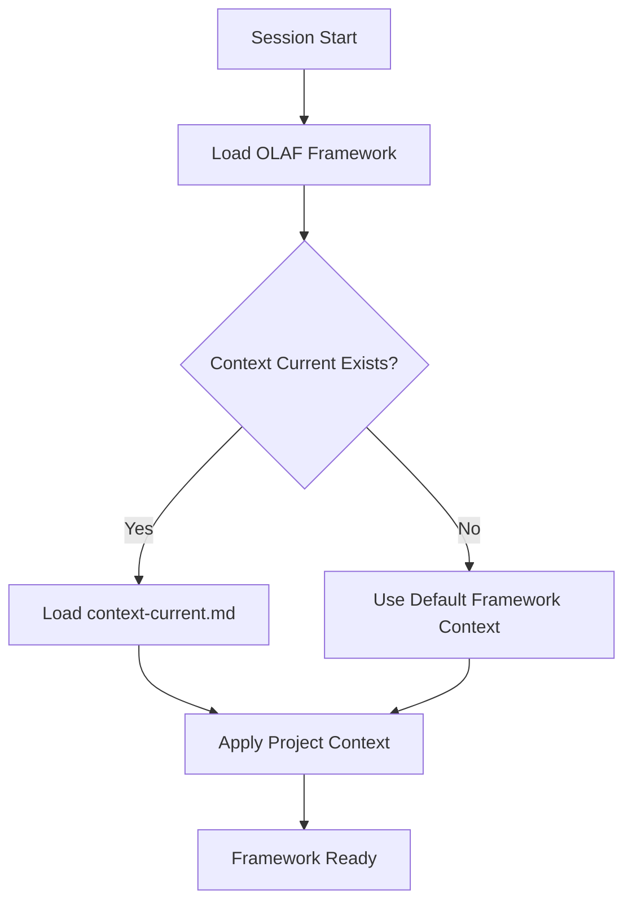
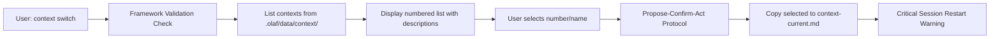
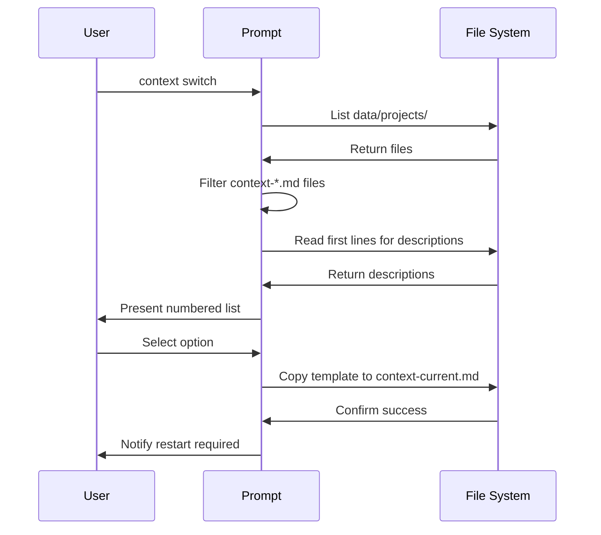

# OLAF Context Switch Feature

## Overview

The Context Switch feature enables switching between different project contexts within the OLAF framework. Users can select from available context templates stored in `.olaf/data/context/` and activate them for their session through the sophisticated switch-context skill.

## Purpose

- **IDE-Aware Context Management**: Advanced context switching with automatic discovery and transitive loading
- **Framework-Validated Operations**: Enforces OLAF framework principles and interaction protocols
- **Bootstrap Integration**: Automatically loads `context-current.md` during framework initialization across platforms
- **Template-Based System**: Uses context template files with descriptions and metadata
- **Session Isolation**: Context changes take effect in new sessions with explicit user guidance

## Bootstrap Sequence Integration

The context switch feature is integrated into the OLAF bootstrap sequence through the GitHub Copilot instructions system:



### Bootstrap Files Integration

The feature modifies the bootstrap sequence in GitHub Copilot through:

1. **`.github/instructions/olaf-bootstrap.instructions.md`** - GitHub Copilot bootstrap instructions

The bootstrap process loads `context-current.md` (if it exists) after loading the core framework as specified in the condensed framework loading sequence.

## Context Switch Workflow

The switch-context skill implements a sophisticated framework-validated workflow:



### Framework Integration
- **Framework Validation**: Applies OLAF work instructions and core principles
- **Conciseness Enforcement**: Mandatory concise output as per framework rules
- **Interaction Protocols**: Uses Act/Propose-Act/Propose-Confirm-Act based on operation risk
- **Error Handling**: Robust validation and user guidance

## File Structure

### Context Directory
- `.olaf/data/context/context-default.md` - Default project context
- `.olaf/data/context/context-*.md` - Additional context templates
- `.olaf/data/context/context-current.md` - Active context (loaded by bootstrap)

### Core Functionality
- `.olaf/core/skills/switch-context/prompts/switch-context.md` - Advanced context switch skill with framework validation

## Usage Examples

### List and Switch Contexts
```
context switch
```
This will:
1. Apply framework validation and conciseness rules
2. Discover and list all context-*.md files from `.olaf/data/context/`
3. Extract and show descriptions from each context file
4. Present numbered list for user selection
5. Use Propose-Confirm-Act protocol for context switching
6. Copy selected context to context-current.md
7. **Critical**: Display session restart warning with explicit instructions

### Switch to Specific Context
```
context switch springboot-hexagonal
```
Directly switch to named context with validation

### Clear Current Context
```
context clear
```
Removes `context-current.md` with session restart warning

### Check Current Status
```
context status
```
Shows active context and available alternatives

## Advanced Features

### Framework Compliance
- **Framework Validation**: All operations enforce OLAF work instructions
- **Conciseness Enforcement**: Outputs strictly follow framework conciseness rules
- **Protocol Adherence**: Risk-appropriate interaction protocols (Act/Propose-Act/Propose-Confirm-Act)
- **Error Handling**: Comprehensive validation with clear error messages

### Context Discovery
- **Automatic Detection**: Scans `.olaf/data/context/` for all context-*.md files
- **Description Extraction**: Reads context file headers and content for meaningful descriptions  
- **Metadata Support**: Handles context files with various description formats
- **Fallback Handling**: Graceful handling of missing descriptions

## Context Template Structure

Each context template follows this structure:

```markdown
# Project Context - {Context Name}

## Project Overview
Brief description of the project type and context

## Architecture Overview  
Key architectural patterns and approaches

## Key Technologies
- Technology stack
- Framework specifics
- Development tools

## Development Guidelines
- Coding standards
- Best practices
- Project-specific rules

## Additional Context
- Domain knowledge
- Business rules
- Technical constraints
```

## Critical Session Management

### Session Restart Requirement
The switch-context skill provides **explicit and prominent warnings** about session restart requirements:

- **Warning Format**: "⚠️ **IMPORTANT**: Please start a new conversation for the '{context_name}' context to be active. The context change will only take effect in a fresh session."
- **Clear Instructions**: Users receive step-by-step guidance on how to start new sessions
- **Consistency**: Same warning pattern for context switching and clearing operations

### Bootstrap Loading Sequence
1. Framework loads `.olaf/core/reference/.condensed/olaf-framework-condensed.md`
2. Framework loads `.olaf/data/context/context-current.md` (if exists)
3. Context-specific instructions become active
4. User can begin work with new context applied

## Technical Implementation

### File Operations
- **Source Templates**: `.olaf/data/context/context-*.md` (with validation)
- **Active Context**: `.olaf/data/context/context-current.md` (copied from template)
- **Backup Handling**: Safe file operations with error recovery

### Validation Rules
- Context files must exist before listing
- User selections validated against available options  
- File copy operations confirmed before user notification
- Graceful handling of missing or corrupted context files

### Integration Points
- **Bootstrap System**: Automatic loading via olaf-bootstrap instructions
- **Framework Validation**: Full compliance with OLAF work instructions
- **Intent-Based Context Injection**: Compatible with practice file loading system
- **Cross-Platform Support**: Works across different IDE environments

## Related Features

- **[Framework Management](framework-management.md)**: Core framework loading and condensed format
- **[OLAF Bootstrap](olaf-bootstrap.md)**: Cross-platform initialization system  
- **[Intent-Based Context Injection](intent-based-context-injection.md)**: Just-in-time context loading
7. **Critical**: Display session restart warning with explicit instructions

### Switch to Specific Context
```
context switch springboot-hexagonal
```
Directly switch to named context with validation

### Clear Current Context
```
context clear
```
Removes `context-current.md` with session restart warning

### Check Current Status
```
context status
```
Shows active context and available alternatives

## Advanced Features

### Framework Compliance
- **Framework Validation**: All operations enforce OLAF work instructions
- **Conciseness Enforcement**: Outputs strictly follow framework conciseness rules
- **Protocol Adherence**: Risk-appropriate interaction protocols (Act/Propose-Act/Propose-Confirm-Act)
- **Error Handling**: Comprehensive validation with clear error messages

### Context Discovery
- **Automatic Detection**: Scans `.olaf/data/context/` for all context-*.md files
- **Description Extraction**: Reads context file headers and content for meaningful descriptions  
- **Metadata Support**: Handles context files with various description formats
- **Fallback Handling**: Graceful handling of missing descriptions

## Context Template Structure

Each context template follows this structure:

```markdown
# Project Context - {Context Name}

## Project Overview
Brief description of the project type and context

## Architecture Overview  
Key architectural patterns and approaches

## Key Technologies
- Technology stack
- Frameworks and libraries
- Development tools

## Development Guidelines
- Coding standards
- Best practices
- Naming conventions

## Module Structure
Detailed structure and organization patterns
```

## Implementation Details

### Auto-Discovery Process



### File Operations

1. **Template Discovery**: Scans `data/projects/` for `context-*.md` files
2. **Context Activation**: Copies selected template to `context-current.md`
3. **Context Clearing**: Deletes `context-current.md` file
4. **Bootstrap Loading**: Framework loads `context-current.md` during initialization

## Dependencies

### Framework Integration
- Requires OLAF framework bootstrap sequence
- Integrates with competency routing system
- Uses standard file operation tools

### IDE Integration
- Kiro IDE steering files
- Windsurf IDE rules
- GitHub Copilot instructions

## Session Management

**Critical Requirement**: Context changes only take effect in new sessions/conversations.

### Why Session Restart is Required
- Context is loaded during framework initialization
- Changing context mid-session doesn't reload the framework
- Clean state ensures consistent behavior
- Prevents context mixing or conflicts

### User Notification
The system provides clear notifications:
```
⚠️ **IMPORTANT**: Please start a new conversation for the 'springboot-hexagonal' context to be active. 
The context change will only take effect in a fresh session.
```
*(Note: springboot-hexagonal shown as fictional example)*

## Error Handling

- **Missing Templates**: Graceful handling with clear error messages
- **Invalid Selections**: Validation of user input with helpful feedback
- **File Operation Failures**: Robust error handling with fallback options
- **Empty Directory**: Handles cases where no context templates exist

## Extensibility

### Adding New Contexts
1. Create new template file: `data/projects/context-{name}.md`
2. Follow standard context template structure
3. Include descriptive first lines for auto-discovery
4. Test context switching functionality

### Custom Context Templates
- Support for organization-specific contexts
- Technology stack specific templates
- Project type specific configurations
- Team workflow customizations

## Benefits

- **Productivity**: Quick switching between project contexts
- **Consistency**: Template-based approach ensures uniform structure
- **Flexibility**: Support for multiple project types and architectures
- **Integration**: Seamless integration with OLAF framework bootstrap
- **User Experience**: Intuitive commands and clear feedback